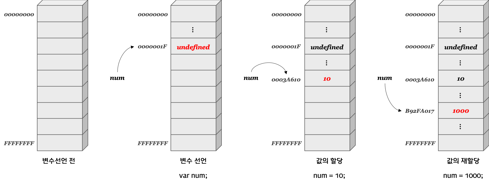

### 4.1 변수란 무엇인가? 왜 필요한가?

- `변수`는 하나의 값을 저장하기 위해 확보한 **메모리 공간 자체** 또는 **그 메모리 공간을 식별하기 위해 붙인 이름**이다.



- 컴퓨터는 연산하기 위해 CPU를 사용하며, 데이터를 기억하기 위해 **메모리**를 사용한다.
- 메모리는 데이터를 저장할 수 있는 1바이트(8비트)짜리 메모리 셀의 집합체이다. 각 셀은 고유한 메모리 주소를 가진다.
- 컴퓨터는 연산을 수행하고 메모리 상의 임의의 위치에 2진수로 값을 저장한다.
- 직접적인 메모리 제어는 시스템 오류를 유발하거나 메모리 주소가 값이 저장될 때마다 변경되므로 지양되므로 변수를 통해 메모리 주소에 접근해야 한다.

- `변수 이름(변수명)`: 메모리 공간에 저장된 값을 식별할 수 있는 고유한 이름
- `변수 값`: 변수에 저장된 값
- `할당(대입, 저장)`: 변수에 값을 저장하는 것
- `참조`: 변수에 저장된 값을 읽어 들이는 것

- 변수 이름을 통해 참조를 요청하면 자바스크립트 엔진은 변수 이름과 매핑된 메모리 주소를 통해 메모리 공간에 접근해서 저장된 값을 반환한다.

### 4.2 식별자

- `식별자`는 어떤 값을 구별해서 식별할 수 있는 고유한 이름을 말하며, 변수 이름을 식별자라고도 한다.
- 식별자는 값이 저장되어 있는 메모리 주소를 기억하고 있으며, 메모리를 구별&식별하기 위해서 식별자의 메모리 주소를 통해 접근한다.
- 식별자라는 용어는 변수 뿐 아니라 함수, 클래스 이름이 될 수도 있다.

### 4.3 변수 선언

- `변수 선언`이란 값을 저장하기 위한 메모리 공간을 확보하고 변수 이름과 확보된 메모리 공간의 주소를 연결해서 값을 저장할 수 있게 준비하는 것이다.
- 변수를 사용하려면 반드시 선언을 해야 하며, 선언하지 않은 식별자에 접근하면 'ReferenceError'가 발생한다.
- 변수를 선언할 때 사용되는 키워드는 **var**, **let**, **const**이다.
- `var`을 사용한 변수 선언문은 다음과 같다.

  ```
  var score;
  ```

- 자바스크립트 엔진은 변수 선언을 **선언 단계**와 **초기화 단계** 두 단계에 거쳐 수행한다. 초기화란 변수가 선언된 이후 최초로 값을 할당하는 것을 말한다.
- var 변수 선언은 선언 단계와 초기화 단계가 동시에 진행되며 초기화는 'undefined'로 실행된다.

### 4.4 변수 선언의 실행 시점과 변수 호이스팅

- 아래 예시와 같이 변수 선언문보다 변수를 참조하는 코드가 앞에 있으면 **변수 호이스팅**이 발생한다.

  ```
  console.log(score); // undefined (ReferenceError가 아님)
  var score; // 변수 선언문
  ```

- `변수 호이스팅`이란 변수 선언문이 코드의 선두로 끌어 올려진 것처럼 동작하는 것으로, 이 때문에 변수 선언의 위치와 상관없이 어디서든지 변수를 참조할 수 있다.
- 변수 호이스팅이 일어나는 이유는 변수 선언을 포함한 모든 선언문이 **런타임**이 아니라 그 이전 단계인 **소스코드 평가 과정**에서 먼저 실행되기 때문이다.

  #### 예제 4-10

  ```
  console.log(score);

  score = 80;
  var score;

  console.log(score); // 해당 답은 80이다.
  ```

  위 문제는 이것과 동일하다.

  ```
  var score;
  console.log(score);

  score = 80;

  console.log(score); // 80
  ```

  다만 아래의 예시의 경우 선언만 끌어올려지므로 주의해야 한다.
  (참고: https://www.youtube.com/watch?v=3ZP3VPlrr0U&t=1027s)

  ```
  console.log(score);

  score = 80;
  var score=50;

  console.log(score); // 50
  ```

  실제로 위 예시는 이렇게 동작한다. 즉, 선언만 끌어올려지고 할당 부분은 남는다.

  ```
  var score;
  console.log(score); // undefined

  score = 80;
  score=50;

  console.log(score); // 50
  ```

### 4.5 값의 할당

- 변수의 `할당`은 우변의 값을 좌변의 변수에 할당한다는 것이다.
  ```
  var score; // 변수 선언
  score; // 값의 할당
  ```
- 변수 선언은 런타임 이전(소스코드 평가 과정)에서 먼저 실행되고, 값의 할당은 런타임 시점에 실행된다.
- 변수에 값을 할당할 대는 이전 값 undefined가 저장되어 있던 메모리 공간을 지우는 것이 아니라, undefined가 저장된 메모리 값은 그대로 두고 새로운 메모리 공간을 확보한 뒤 그곳에 새로운 할당값을 저장하는 것이다.

### 4.6 값의 재할당

- `재할당`이란 이미 값이 할당되어 있는 변수에 새로운 값을 또다시 할당하는 것을 말하는데, 'var'는 선언과 동시에 undefined로 초기화되기 때문에 처음으로 값을 할당하는 것도 사실은 재할당이다.
- 재할당을 할 수 없다면 변수가 아니라 `상수`이다. 즉, 상수는 단 한번만 할당할 수 있는 변수다.
- 재할당 할 때마다 새로운 메모리 공간을 확보한뒤 새로운 값을 저장한다.
- 현재 변수 값 이전 값들은 어떤 식별자와도 연결되어 있지 않으며, 이러한 불필요한 값들은 `가비지 콜렉터`에 의해 메모리에서 자동으로 해제된다.
  ```
  자바스크립트는 매니지드 언어로, 개발자가 직접 명시적으로 메모리를 할당하고 해제할 수 없다. 대신 가비지 콜렉터가 메모리 공간을 주기적으로 검사하여 더 이상 사용되지 않는 메모리를 해제한다.
  ```

### 4.7 식별자 네이밍 규칙

- 식별자는 특수문자를 제외한 문자 ,숫자, '\_', '$'를 포함할 수 있다.
- 식별자는 특수문자를 제외한 문자, '\_', '$'로 시작해야 하며 숫자로 시작할 수 없다.
- 예약어는 식별자로 사용할 수 없다.
- 네이밍 컨벤션은 가독성 좋게 단어를 구분하기 위해 규정한 명명 규칙이다.

  ```
  [네이밍 컨벤션 예시]

  var camelCase // 일반적인 변수나 함수 이름에 사용
  var PascalCase // 생성자 함수, 클래스 이름에 사용
  var snake_case
  ```
