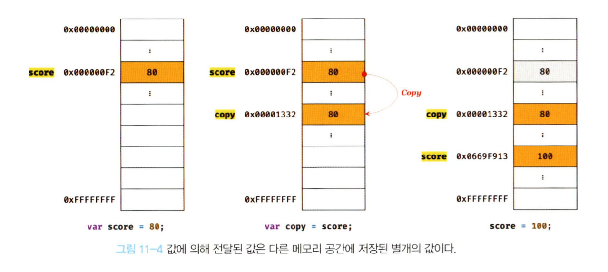
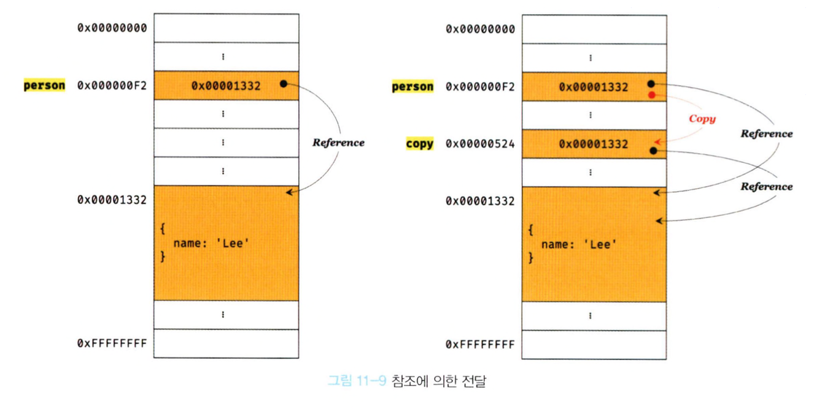

|원시 타입|객체 타입|
|---|---|
|원시 타입의 값(원시 값)은 변경 불가능한 값|객체(참조) 타입의 값(객체)은 변경 가능한 값|
|원시 값을 변수에 할당하면 변수(확보된 메모리 공간)에는 실제 값이 저장|객체를 변수에 할당하면 변수(확보된 메모리 공간)에는 참조 값이 저장|
|원시 값을 갖는 변수를 다른 변수에 할당하면 원본의 원시 값이 복사되어 전달 (값에 의한 전달)|객체를 가리키는 변수를 다른 변수에 하당하면 원본의 참조값이 복사되어 전달(참조에 의한 전달)|

## 11.1 원시 값
### 11.1.1 변경 불가능한 값
- 원시 타입의 값(원시 값)은 변경 불가능한 값.
- 원시 값 자체를 변경할 수 없다는 것이지 변수 값을 변경할 수 없다는 것이 아니다. 변수는 언제든지 재할당을 통해 변수 값을 변경할 수 있다.
- 변수 값을 변경하기 위해 원시 값을 재할당하면 새로운 메모리 공간을 확보하고 재할당한 값을 저장한 후, 변수가 참조하던 메모리 공간의 주소를 변경한다. 값의 이러한 특성을 불변성(immutability)이라 한다.

### 11.1.2 문자열과 불변성
- 문자열은 0개 이상의 문자로 이뤄진 집합을 말하며, 1개의 문자는 2바이트 메모리 공간에 저장된다.
- 문자열은 몇 개의 문자로 이뤄졌느냐에 따라 필요한 메모리 공간의 크기가 결정된다.
- 자바스크립트의 문자열은 원시 타입이며, 변경 불가능하다.
- 문자열은 유사 배열 객체로 마치 배열처럼 인덱스 프로퍼티 값에 접근할 수 있고, length 프로퍼티를 갖는 객체이다.
  ```
  var str = 'string';
  str[0] = 'S';

  console.log(str); // string
  ```
  - 문자열은 유사 배열이므로 배열과 유사하게 인덱스를 사용해 각 문자에 접근할 수 있지만, 문자열은 원시 값이므로 변경이 불가능하다.
  - 변수에 새로운 문자열을 재할당하는 것은 가능하다.

### 11.1.3 값에 의한 전달
- 값에 의한 전달은 값을 전달하는 것이 아니라 메모리 주소를 전달한다. 단, 전달된 메모리 주소를 통해 메모리 공간에 접근하면 값을 참조할 수 있다.
  ```
  var score = 80;

  // copy 변수에는 score 변수의 값 80이 복사되어 할당된다.
  var copy = score;

  console.log(score, copy);     // 80 80
  console.log(score === copy) ; // true

  // score 변수와 copy 변수의 값은 다른 메모리 공간에 저장된 별개의 값이다.
  // 따라서 score 변수의 값을 변경해도 copy 변수의 값에는 어떠한 영향도 주지 않는다.
  score = 100;

  console.log(score, copy);    // 100 80
  console.log(score === copy); // false
  ```
  

## 11.2 객체
### 11.2.1 변경 가능한 값
- 객체(참조) 타입의 값인 객체는 변경 가능한 값이다.
- 원시 값은 변경 불가능한 값이므로 원시 값을 갖는 변수의 값을 변경하려면 재할당 외에는 방법이 없지만, 객체는 변경 가능한 값이기 때문에 재할당 없이 프로퍼티를 동적으로 추가할 수도 있고 프로퍼티 값을 갱신할 수도 있으며 프로퍼티 자체를 삭제할 수도 있다.
  ```
  var person = {
    name: 'Lee'
  };
  
  person.name = 'Kim';
  person.address = 'Seoul';

  console.log(person); // {name: "Kim", address: "Seoul"}
  ```
- 객체의 단점은 원시 값과는 다르게 여러 개의 식별자가 하나의 객체를 공유할 수 있다는 것이다.
#### 얕은 복사와 깊은 복사
- 객체를 프로퍼티 값으로 갖는 객체의 경우 얕은 복사는 한 단계까지만 복사하는 것을 말하고, 깊은 복사는 객체에 중첩되어 있는 객체까지 모두 복사하는 것을 말한다.
  ```
  const o = { x: { y: 1 } };

  // 얕은 복사
  const c1 = { ...o };
  console.log(c1 === o);     // false
  console.log(c1.x === o.x); // true

  // 깊은 복사
  const _ = require('lodash');
  const c2 = _.cloneDeep(o);
  console.log(c2 === o);     // false
  console.log(c2.x === o.x); // false
  ```

### 11.2.2 참조에 의한 전달
- "값에 의한 전달"과 "참조에 의한 전달"은 식별자가 기억하는 메모리 공간에 저장되어 있는 값을 복사해서 전달한다는 면에서 동일하다. 다만 식별자가 기억하는 메모리 공간, 즉 변수에 저장되어 있는 값이 원시 값이냐 참조 값이냐의 차이만 있다.
  ```
  var person = {
    name: 'Lee'
  };

  // 참조 값을 복사 (얕은 복사)
  var copy = person;

  // copy와 person은 동일한 객체를 참조한다.
  console.log(copy === person); // true

  copy.name = 'Kim';
  person.address = 'Seoul';

  // copy와 person은 동일한 객체를 가리키므로 어느 한쪽에서 객체를 변경하면 서로 영향을 주고받는다.
  console.log(person); // {name: "Kim", address: "Seoul"}
  console.log(copy);   // {name: "Kim", address: "Seoul"}
  ```
  