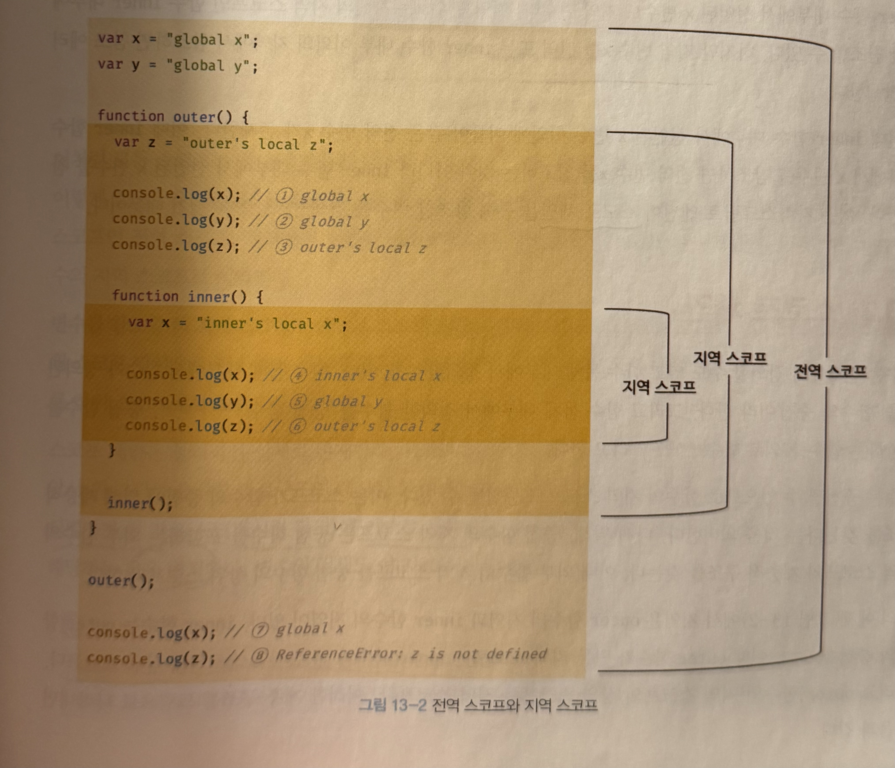
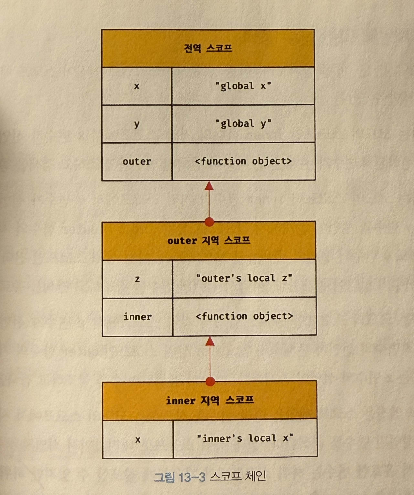

## 스코프란?

- 모든 식별자는 자신이 선언된 위치에 의해 다른 코드가 식별자 자신을 참조할 수 있는 유효범위가 결정된다.
- 즉, 스코프는 식별자가 유효한 범위이다.
- `식별자 결정`이란 자바스크립트 엔진이 스코프를 통해 어떤 변수를 참조해야 할 것인지 결정하는 것을 말한다.
- 스코프 내에서 식별자는 유일해야 하지만 다른 스코프에는 같은 이름의 식별자를 사용할 수 있다. 즉 스코프는 `네임스페이스`다.

## 스코프의 종류



- 위 예시에서 inner() 내부에는 전역변수 'global x' 와 같은 이름인 지역변수 x가 있다. 이 때 inner() 내부에서 x를 참조하면 inner 내부의 x인 'inner's local x' 를 참조하게 된다.
- 이는 자바스크립트 엔진이 `스코프 체인`을 통해 참조할 변수를 검색했기 때문이다.

## 스코프 체인

- 스코프는 함수의 중첩에 의해 계층적 구조를 갖는다.
  
- outer 함수는 inner 함수의 상위 스코프이다. 전역 스코프는 outer 함수의 상위 스코프이다.
- 스코프가 계층적으로 연결된 것을 `스코프 체인`이라고 한다. 변수를 참조할 때 자바스크립트 엔진은 스코프 체인을 통해 변수를 참조하는 코드의 스코프에서 시작하여 상위 스코프 방향으로 이동하며 선언된 변수를 검색한다.
- 스코프 체인은 물리적인 실체로 존재한다. 변수 선언이 실행되면 변수 식별자가 `렉시컬 환경`에 `키`로 등록되고, 변수 할당이 일어나면 이 자료구조의 변수 식별자에 해당하는 값을 변경한다.

### 스코프 체인에 의한 변수 검색

- 상위 스코프에서 유효한 변수는 하위 스코프에서 자유롭게 참조할 수 있지만 하위 스코프에서 유효한 변수를 상위 스코프에서 참조할 수 없다.

### 스코프 체인에 의한 함수 검색

- 함수도 식별자이므로 스코프를 갖는다. 함수 선언문으로 함수를 정의하면 런타임 이전에 함수 객체가 먼저 생성된다.

## 함수 레벨 스코프

- 함수 레벨 스코프는 코드 블록이 아닌 함수에 의해서만 지역 스코프가 생성된다는 뜻이다.
- var 키워드로 선언된 변수는 오로지 함수의 코드 블록만을 지역 스코프로 인정한다.

```
var i=0;

for(var i=0; i<5; i++){
    console.log(i) // 0 1 2 3 4
}

console.log(i) //5
```

- 위 예시에서 for문(블록레벨) 내부의 var가 의도치 않게 전역 변수로 기능하기 때문에, 4까지 반복문이 끝나고 i++을 해서 i=5가 되었을 때 var i=0; 에 5를 재할당하기 때문에 맨 아래 console.log(i)의 값은 5가 된다.

## 렉시컬 스코프

- 렉시컬 스코프 또는 정적 스코프란 `함수가 평가되는 시점`에 상위 스코프가 정적으로 결정되는 것을 말한다. 반면 동적 스코프는 `함수가 호출되는 시점`에 스코프가 결정되는 것을 말한다. 자바스크립트는 렉시컬 스코프를 따른다.
- 자바스크립트는 렉시컬 스코프를 따르므로 함수가 정의된 위치에 따라 상위 스코프를 결정한다.

```
var x = 1;

function foo(){
  var x=10;
  bar();
}

function bar(){
  console.log(x);
}

foo(); ------ (2)
bar(); ------ (3)
```

- 위 예시에서 (2)의 답은 1이다. 왜냐하면 foo나 bar 모두 함수가 호출되기 전에 먼저 전역에서 함수 객체를 생성해놨으며 이 때의 전역 스코프를 상위 스코프로 사용하기 때문이다.
