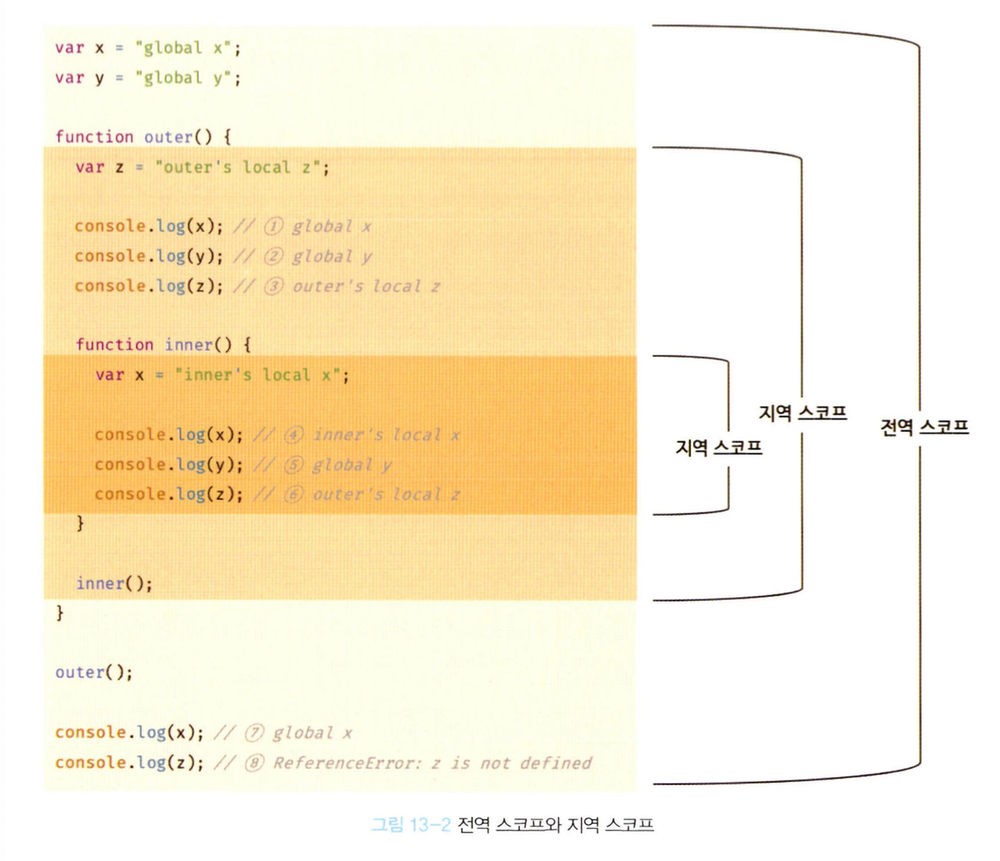

## 13.1 스코프란?
- 스코프란 식별자가 유효한 범위를 말한다.
- 모든 식별자는 자신이 선언된 위치에 의해 다른 코드가 식별자 자신을 참조할 수 있는 유효 범위가 결정된다.
  ```
  var var1 = 1;

  if(true) {
    var var2 = 2;
    if(true) {
      var var3 = 3;
    }
  }

  function foo() {
    var var4 = 4;
  }

  console.log(var1); // 1
  console.log(var2); // 2
  console.log(var3); // 3
  console.log(var4); // ReferenceError: var4 is not defined
  ```
- var 키워드로 선언한 변수의 중복 선언
  - var 키워드로 선언된 변수는 같은 스코프 내에서 중복 선언을 허용한다.
    ```
    function foo() {
      var x = 1;
      var x = 2;
      console.log(x); // 2
    }
    foo();
    ```
  - let이나 const 키워드로 선언된 변수는 같은 스코프 내에서 중복 선언을 허용하지 않는다.
    ```
    function bar() {
      let x = 1;
      let x = 2; // SyntaxError: Identifier 'x' has already been declared
    }
    bar();
    ```

## 13.2 스코프의 종류

### 13.2.1 전역과 전역 스코프
- 전역: 코드의 가장 바깥 영역
- 전역 변수는 어디서든지 참조할 수 있다.
### 13.2.2 지역과 지역 스코프
- 지역: 함수 몸체 내부
- 지역 변수는 자신의 지역 스코프와 하위 지역 스코프에서 유효하다.

## 13.3 스코프 체인
- 중첩 함수: 함수 몸체 내부에서 정의한 함수
- 외부 함수: 중첩 함수를 포함하는 함수
- 스코프는 함수의 중첩에 의해 계층적인 구조를 갖는데 이렇게 스코프가 계층적으로 연결된 것을 스코프 체인이라고 한다.
- 변수를 참조할 때 자바스크립트 엔진은 스코프 체인을 통해 변수를 참조하는 코드의 스코프에서 시작하여 상위 스코프 방향으로 이동하며 선언된 변수를 검색한다.

### 13.3.1 스코프 체인에 의한 변수 검색
- 상위 스코프에서 유효한 변수는 하위 스코프에서 자유롭게 참조할 수 있지만 하위 스코프에 유효한 변수를 상위 스코프에서 참조할 수는 없다. (전역 스코프와 지역 스코프 그림 4, 5, 6 참고)

### 13.3.2 스코프 체인에 의한 함수 검색
```
// 전역 함수
function foo() {
  console.log( 'global function foo' );
}

function bar() { 
  // 중첩 함수 
  function foo() {
    console.log('local function foo' ); 
  }
  foo(); // local function foo
}

bar();
```

## 13.4 함수 레벨 스코프
- 블록 레벨 스코프 
  - C나 자바 등을 비롯한 대부분의 프로그래밍 언어는 함수 몸체 뿐만 아니라 모든 코드 블록(if, for, while, try/catch 등)이 지역 스코프를 만든다.
    ```
    var x = 1;

    if(true) { // 코드 블록
      var x = 10;
    }

    console.log(x); // 10
    ```
- 함수 레벨 스코프
  - var 키워드로 선언된 변수는 오로지 함수의 코드 블록만을 지역 스코프로 인정한다.
  - 코드 블록이 아닌 함수에 의해서만 지역 스코프가 생성된다.
  - var 키워드로 선언된 변수는 오로지 함수의 코드 블록만을 지역 스코프로 인정하지만 ES6에서 도입된 let, const 키워드는 블록 레벨 스코프를 지원한다.

## 13.5 렉시컬 스코프
```
var x = 1;

function foo() {
  var x = 10;
  bar();
}

function bar() {
  console.log(x);
}

foo(); // ?
bar(); // ?
```
- 동적 스코프
  - 함수를 어디서 호출했는지에 따라 함수의 상위 스코프를 결정
- 렉시컬 스코프(정적 스코프)
  - 함수를 어디서 정의했는지에 따라 함수의 상위 스코프를 결정
  - 함수가 호출된 위치는 상위 스코프 결정에 어떠한 영향도 주지 않는다.
  - 함수의 상위 스코프는 함수 정의가 실행될 때 정적으로 결정된다.
- 자바스크립트를 비롯한 대부분의 프로그래밍 언어는 렉시컬 스코프를 따른다.
- 따라서 위 예제를 실행하면 전역 변수 x의 값 1을 두 번 출력한다.
