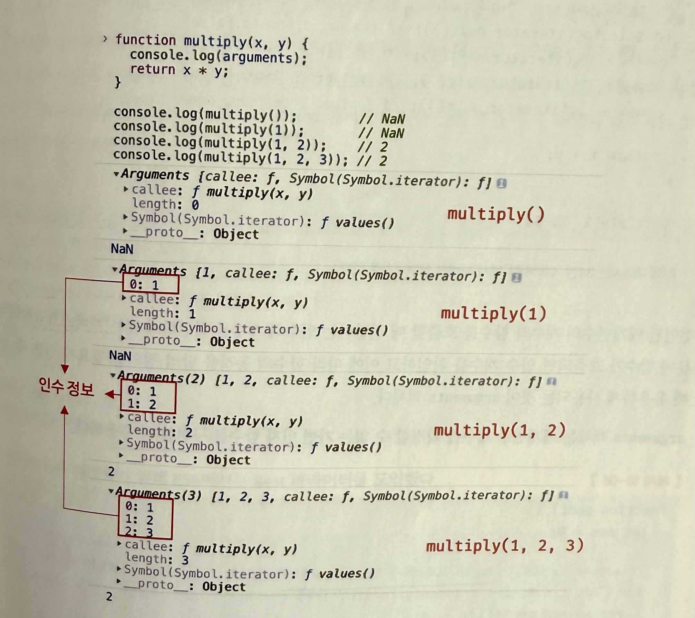

## 일급 객체

- 일급 객체 조건 - 리터럴로 생성 가능 (즉, 런타임에 생성 가능). - 변수나 자료구조에 저장 가능. - 함수의 매개변수로 전달 가능. - 함수의 반환값으로 사용 가능.
  자바스크립트의 함수는 위 조건을 만족하므로 일급 객체

## 함수 객체의 프로퍼티

- 함수는 일반 객체와 달리 고유의 프로퍼티를 가진다.
- console.dir(함수)로 함수 객체 내부 구조를 확인할 수 있음.

```
function square(number) {
  return number * number;
}

console.dir(square);

// console.dir(square) 실행 시:
f square(number)
arguments: null
caller: null
length: 1
name: "square"
prototype: {constructor: f}
__proto__: f ()

```

- 프로퍼티의 어트리뷰트를 확인해보면 다음과 같다.

```
console.log(Object.getOwnPropertyDescriptors(square));

{
  "length": { "value": 1, "writable": false, "enumerable": false, "configurable": true },
  "name": { "value": "square", "writable": false, "enumerable": false, "configurable": true },
  "arguments": { "value": null, "writable": false, "enumerable": false, "configurable": false },
  "caller": { "value": null, "writable": false, "enumerable": false, "configurable": false },
  "prototype": { "value": {...}, "writable": true, "enumerable": false, "configurable": false }
}

```

### arguments 프로퍼티

- 함수 내부에서 arguments 객체를 통해 전달된 모든 인자를 참조할 수 있음.
- 유사 배열 객체 (array-like object) 로, length 프로퍼티를 가지고 있음.
- 하지만 배열(Array)이 아니므로 map, forEach 등의 배열 메서드를 직접 사용할 수 없음. \*for문은 가능
- arguments 객체는 선언된 매개변수 개수와 상관없이 함수가 호출될 때 전달된 모든 인수를 포함함.
- ES3까지는 함수 객체의 프로퍼티로 arguments가 있었음.
- 하지만 ES5부터 비표준으로 취급되었고, 이후 ES6에서 Rest Parameter (...args) 가 도입되면서 사용이 권장되지 않음.

```
function multiply(x, y) {
  console.log(arguments);  // arguments 객체 출력
  return x * y;
}

// 함수가 선언된 매개변수 개수보다 적거나 많은 인수를 전달해도 arguments 객체를 통해 접근 가능함.
// 매개변수 개수보다 적게 전달하면 undefined 값을 가짐.
console.log(multiply());        // NaN
console.log(multiply(1));       // NaN
// 초과된 인수는 무시되지 않고 arguments 객체에 저장됨.
console.log(multiply(1, 2));    // 2
console.log(multiply(1, 2, 3)); // 2

```



### caller 프로퍼티

- 자신을 호출한 함수 정보를 가리킴.
- ECMAScript 표준이 아님.

```
function foo(func) {
  return func();
}

function bar() {
  return 'caller: ' + bar.caller;
}

console.log(foo(bar)); // caller: function foo(func) { ... }
console.log(bar());    // caller: null

```

### length 프로퍼티

- 함수 정의 시 명시된 매개변수 개수를 나타냄.

```
function foo() {}
console.log(foo.length); // 0

function bar(x) { return x; }
console.log(bar.length); // 1

function baz(x, y) { return x * y; }
console.log(baz.length); // 2

```

### **proto** 프로퍼티

- 모든 객체는 [[Prototype]]이라는 내부 슬롯을 가지고 있음.
- **proto**는 [[Prototype]] 내부 슬롯을 간접적으로 접근하기 위한 프로퍼티이다.
- 하지만, 표준이 아닌 비공식적인 접근 방식이며, ES6 이후 Object.getPrototypeOf() 사용을 권장함.

```
const obj = { a: 1 };

// 객체 리터럴 방식으로 생성된 객체의 프로토타입은 Object.prototype이다.
console.log(obj.__proto__ === Object.prototype); // true

// hasOwnProperty 메서드는 Object.prototype의 프로퍼티다.
console.log(obj.hasOwnProperty('a'));        // true
console.log(obj.hasOwnProperty('__proto__')); // false

```

-객체 리터럴 {}로 생성된 객체의 프로토타입은 Object.prototype.

- hasOwnProperty('**proto**')가 false인 이유는 **proto**가 객체 자신의 프로퍼티가 아니라 프로토타입 체인을 따라 상속된 프로퍼티이기 때문.

### prototype 프로퍼티

- 생성자 함수에서만 존재.
- 일반 객체는 prototype 프로퍼티가 없음.

```
(function () {}).hasOwnProperty('prototype'); // true
({}).hasOwnProperty('prototype'); // false

```
