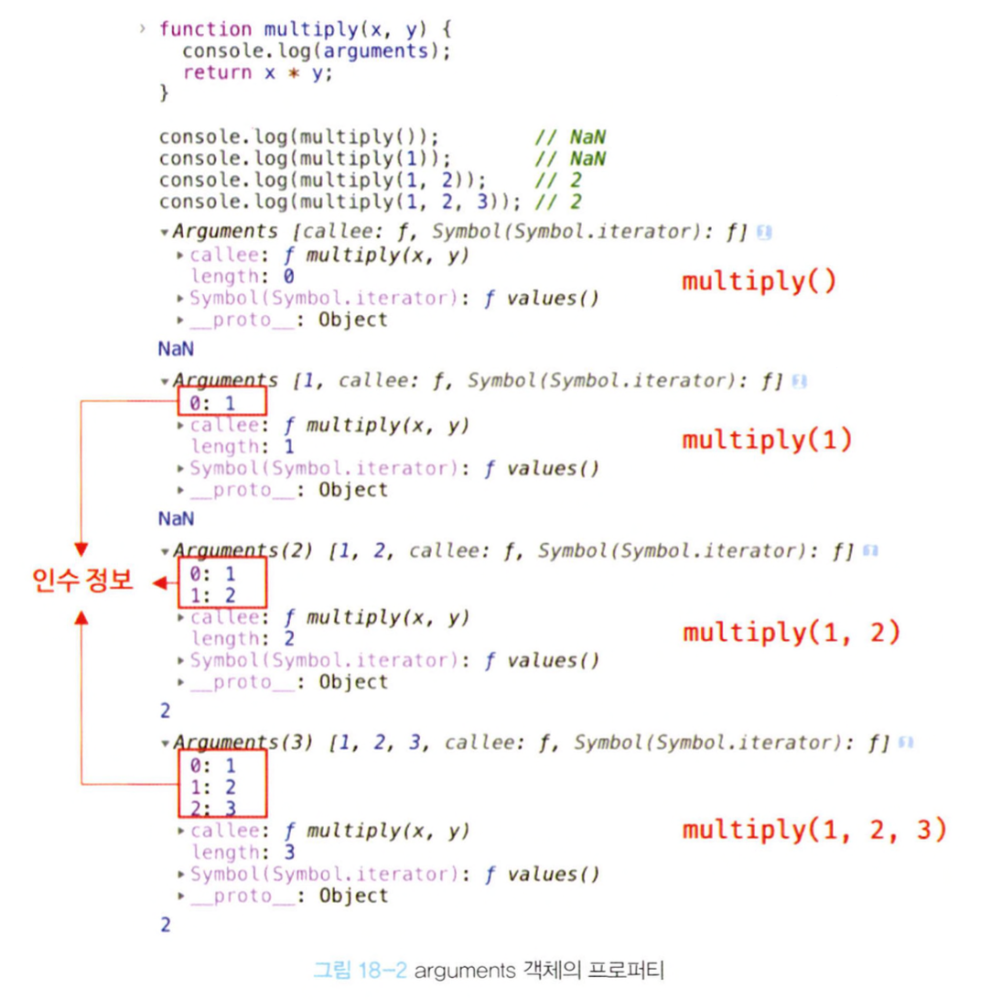

## 18.1 일급 객체
- 일급 객체란?
  1. 무명의 리터럴로 생성할 수 있다. 즉, 런타임에 생성이 가능하다.
  2. 변수나 자료구조(객체, 배열 등)에 저장할 수 있다.
  3. 함수의 매개변수에 전달할 수 있다.
  4. 함수의 반환값으로 사용할 수 있다.
- 자바스크립트의 함수는 위의 조건을 모두 만족하므로 일급 객체다.
- 함수가 일급 객체라는 것은 함수를 객체와 동일하게 사용할 수 있다는 의미이다.
  ```
  // 1. 함수는 무명의 리터럴로 생성할 수 있다.
  // 2. 함수는 변수에 저장할 수 있다.
  const increase = function (num) {
    return ++num;
  }
   
  // 2. 함수는 객체에 저장할 수 있다.
  const predicates = { increase };
   
  // 3. 함수의 매개변수에 전달할 수 있다.
  // 4. 함수의 반환값으로 사용할 수 있다.
  function makeCounter(predicate) {
    let num = 0;
    return function() {
      num = predicate(num);
      return num;
    }
  }
   
  // 3. 함수는 매개변수에 함수를 전달할 수 있다.
  const increaser = makeCounter(predicates.increase);
  console.log(increaser()); // 1
  console.log(increaser()); // 2
  ```

## 18.2 함수 객체의 프로퍼티
- arguments, caller, length, name, prototype 은 모두 함수 객체의 데이터 프로퍼티이며, 일반 객체에는 없는 함수 객체 고유의 프로퍼티이다.
- __proto__ 는 접근자 프로퍼티이며, 함수 객체 고유의 프로퍼티가 아니라 Object.prototype 객체의 프로퍼티를 상속받는다.

### 18.2.1 arguments 프로퍼티
- 함수 객체의 arguments 프로퍼티 값은 arguments 객체다.
- arguments 객체는 인수를 프로퍼티 값으로 소유하며, 프로퍼티 키는 인수의 순서를 나타낸다.
- 모든 인수는 암묵적으로 arguments 객체의 프로퍼티로 보관되기 때문에 초과인수는 그냥 버려지는 것이 아니다.
  ```
  function multiply(x, y) {
    console.log(arguments);
    return x * y;
  }

  console.log(multiply());        // NaN
  console.log(multiply(1));       // NaN
  console.log(multiply(1, 2));    // 2
  console.log(multiply(1, 2, 3)); // 2
  ```
  
- arguments 객체는 매개변수 개수를 확정할 수 없는 가변 인자 함수를 구현할 때 유용하다.
  ```
  function sum() {
    let res = 0;

    // arguments 객체는 배열 형태로 인자 정보를 담고 있지만 실제 배열이 아닌 유사 배열 객체다.
    // 유사 배열 객체: length 프로퍼티를 가진 객체로 for문으로 순회할 수 있는 객체
    for (let i = 0; i < arguments.length; i++) {
      res += arguments[i];
    }

    return res;
  }

  console.log(sum());        // 0
  console.log(sum(1, 2));    // 3
  console.log(sum(1, 2, 3)); // 6
  ```

### 18.2.2 caller 프로퍼티
- caller 프로퍼티는 ECMAScript 사양에 포함되지 않은 비표준 프로퍼티이며, 이후 표준화될 예정도 없는 프로퍼티이므로 사용하지 말자.

### 18.2.3 length 프로퍼티
- 함수 객체의 length 프로퍼티는 함수를 정의할 때 선언한 매개변수의 개수를 가리킨다.
  ```
  function foo() {}
  console.log(foo.length); // 0

  function bar(x, y) {
    return x * y;
  }
  console.log(bar.length); // 2
  ```
- 주의할 점: arguments 객체의 length 프로퍼티는 인자의 개수를 가리키고, 함수 객체의 length 프로퍼티는 매개변수의 개수를 가리킨다.

### 18.2.4 name 프로퍼티
- 함수 객체의 name 프로퍼티는 함수 이름을 나타낸다
  ```
  // 기명 함수 표현식
  var namedFunc = function foo() {};
  console.log(namedFunc.name); // foo

  // 익명 함수 표현식
  var anonymousFunc = function() {};
  console.log(anonymousFunc.name); // anonymousFunc

  // 함수 선언문
  function bar() {}
  console.log(bar.name); // bar
  ```

### 18.2.5 __proto__ 접근자 프로퍼티
- __proto__ 프로퍼티는 [[Prototype]] 내부 슬롯이 가리키는 프로토타입 객체에 접근하기 위해 사용하는 접근자 프로퍼티다.

### 18.2.6 prototype 프로퍼티
- prototype 프로퍼티는 생성자 함수로 호출할 수 있는 함수 객체, 즉 constructor만이 소유하는 프로퍼티다.
  ```
  // 함수 객체는 prototype 프로퍼티를 소유한다.
  (function() {}).hasOwnProperty('prototype'); // true

  // 일반 객체는 prototype 프로퍼티를 소유하지 않는다.
  ({}).hasOwnProperty('prototype'); // false
  ```