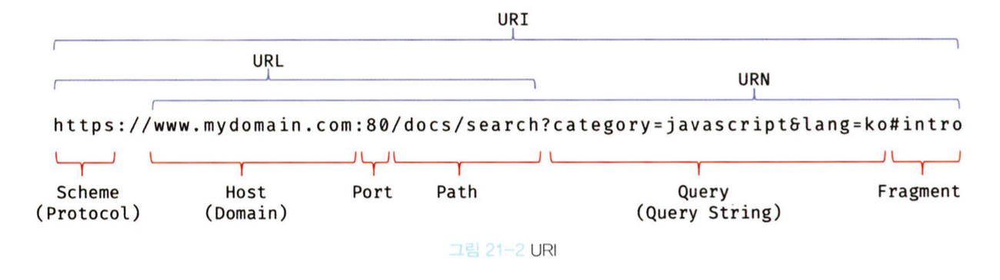

## 21.1 자바스크립트 객체의 분류
- 표준 빌트인 객체
  - ECMAScript 사양에 정의된 객체
  - 전역 객체의 프로퍼티로서 제공되기 때문에 별도의 선언 없이 전역변수처럼 언제나 참조할 수 있다.
- 호스트 객체
  - ECMAScript 사양에 정의되어 있지 않지만 자바스크립트 실행 환경(브라우저 환경 또는 Node.js 환경)에서 추가로 제공하는 객체
- 사용자 정의 객체
  - 표준 빌트인 객체와 호스트 객체처럼 기본 제공되는 객체가 아닌 사용자가 직접 정의한 객체

## 21.2 표준 빌트인 객체
- 자바스크립트는 String, Number, Boolean, Function, Array, Date, Object, JSON 등 40여개의 표준 빌트인 객체를 제공한다.
- Math, Reflect, JSON을 제외한 표준 빌트인 객체는 인스턴스를 생성할 수 있는 생성자 함수 객체이며, 프로토타입 메서드와 정적 메소드를 제공한다.
  ```
  // 생성자 함수로 호출하여 인스턴스 생성
  const strObj = new String('Lee');
  const numObj = new Number(1.5);
  const func = new Function('x', 'return x * x');
  const arr = new Array(1, 2, 3);

  // String 생성자 함수를 통해 생성한 strObj 객체의 프로토타입은 String.prototype이다.
  console.log(Object.getPrototypeOf(strObj) === String.prototype); // true

  // toFixed는 Number.prototype의 프로토타입 메서드다.
  console.log(numObj.toFixed()); // 2
  // isInteger는 Number의 정적메서드로 인스턴스 없이 정적으로 호출할 수 있다.
  console.log(Number.isInteger(0.5)); // false
  ```

## 21.3 원시값과 래퍼 객체
- 원시값은 객체가 아니므로 프로퍼티나 메서드를 가질 수 없는데도 원시값인 문자열이 마치 객체처럼 동작한다.
- 원시값을 객체처럼 사용하면 자바스크립트 엔진은 암묵적으로 연관된 객체를 생성하여 생성된 객체로 프로퍼티에 접근하거나 메서드를 호출하고 다시 원시값으로 되돌린다. 이때 생성되는 임시 객체를 래퍼 객체라고 한다.
  ```
  const str = 'hi';

  // 원시 타입인 문자열이 래퍼 객체인 String 인스턴스로 변환된다.
  console.log(str.length); // 2
  console.log(str.toUpperCase()); // HI

  // 래퍼 객체로 프로퍼티에 접근하거나 메서드를 호출한 후, 다시 원시값으로 되돌린다.
  console.log(type of str); // string
  ```

## 21.4 전역 객체
- 전역 객체는 코드가 실행되기 이전 단계에 자바스크립트 엔진에 의해 어떤 객체보다도 먼저 생성되는 특수한 객체이며, 어떤 객체에도 속하지 않는 최상위 객체다.
- 브라우저 환경에서는 window가 전역 객체이다.
  ```
  // 전역 객체의 프로퍼티를 참조할 때 window를 생략할 수 있다.
  window.parseInt('F'. 16); // 15
  parseInt('F'. 16); // 15
  ```
  ```
  // var 키워드로 선언한 전역변수, 선언하지 않은 변수에 값을 할당한 암묵적 전역, 전역함수는 전역 객체의 프로퍼티가 된다.

  // var 키워드로 선언한 전역 변수
  var foo = 1;
  console.log(window.foo); // 1

  // 선언하지 않은 변수에 값을 할당한 암묵적 전역. bar는 전역 변수가 아니라 전역 객체의 프로퍼티다.
  bar = 2; // window.bar = 2
  console.log(window.bar); // 2

  // 전역함수
  function baz() { return 3; }
  console.log(window.baz()); // 3
  ```
  ```
  // let이나 const 키워드로 선언한 전역 변수는 전역 객체의 프로퍼티가 아니다.
  let foo = 123;
  console.log(window.foo); // undefined
  ```

### 21.4.1 빌트인 전역 프로퍼티
- 빌트인 전역 프로퍼티는 전역 객체의 프로퍼티를 의미한다.
    - Infinity: 무한대를 나타내는 숫자값
      ```
      console.log(3/0); // Infinity
      // Infinity는 숫자값이다.
      console.log(typeof Infinity); // number 
      ```
    - NaN: 숫자가 아님을 나타내는 숫자값
      ```
      console.log(Number('xyz')); // NaN
      ```
    - undefined: undefined 프로퍼티는 원시 타입 undefined를 값으로 갖는다.
      ```
      var foo;
      console.log(foo); // undefined
      ```

### 21.4.2 빌트인 전역 함수
- 빌트인 전역 함수는 애플리케이션 전역에서 호출할 수 있는 빌트인 함수로서 전역 객체의 메서드다.
  - isFinite
    ```
    // 전달받은 인수가 정상적인 유한수인지 검사하여 유한수이면 true, 무한수이면 false를 반환한다.
    // 전달받은 인수가 숫자가 아닐 경우, 숫자로 타입을 변환한 후 검사한다.
    isFinite(0); // true
    ifFinite('10'); // true
    ifFinite(Infinity); // false
    ifFinite('Hello'); // false
    ```
  - isNaN
    ```
    // 전달받은 인수가 NaN인지 검사하여 그 결과를 불리언 타입으로 반환한다.
    // 전달받은 인수가 숫자가 아닐 경우, 숫자로 타입을 변환한 후 검사한다.  
    isNaN(NaN); // true
    isNaN(10); // false
    isNaN('blabla'); // true
    isNaN('10'); // false
    ```
  - parseFloat
    ```
    // 전달받은 문자열 인수를 실수로 해석하여 반환한다.
    parseFloat('3.14'); // 3.14
    // 공백으로 구분된 문자열은 첫 번째 문자열만 반환한다.
    parseFloat('24 34 66'); // 24
    // 첫 번쨰 문자열을 숫자로 변환할 수 없다면 NaN을 반환한다.
    parseFloat('He was 40'); // NaN
    ```
  - parseInt
    ```
    // 전달받은 문자열 인수를 정수로 해석하여 반환한다.
    parseInt('10.123'); // 10
    parseInt(10.123); // 10
    // '10'을 2진수로 해석하고 그 결과를 10진수 정수로 반환한다.
    parseInt('10', 2); // 2
    // 공백으로 구분된 문자열은 첫 번째 문자열만 반환한다.
    parseInt('24 34 66'); // 24
    ```
  - encodeURI / decodeURI
    
    ```
    // encodeURI 함수는 완전한 URI를 문자열로 전달받아 이스케이프 처리를 위해 인코딩한다.
    // 이스케이프 처리는 네트워크를 통해 정보를 공유할 때 어떤 시스템에서도 읽을 수 있는 아스키 문자 셋으로 변환하는 것을 말한다.
    // 쿼리 스트링 구분자로 사용되는 =, ?, &는 인코딩하지 않는다.
    const uri = 'http://example.com?name=홍길동&address=seoul';
    const enc = encodeURI(uri);
    console.log(enc); // http://example.com?name=%ED%99%8D%EA%B8%B8%EB%8F%99&address=seoul

    // decodeURI 함수는 인코딩된 URI를 인수로 전달받아 이스케이프 처리 이전으로 디코딩한다.
    const dec = decodeURI(enc);
    console.log(dec); // http://example.com?name=홍길동&address=seoul
    ```
  - encodeURIComponent / decodeURIComponent
    ```
    // URI 구성 요소를 인수로 전달받아 인코딩한다.
    // 쿼리 스트링 구분자로 사용되는 =, ?, & 까지 인코딩한다.
    const uriComp = 'name=홍길동&address=seoul';

    let enc = encodeURIComponent(uriComp);
    console.log(enc) ; // name%3D%ED%99%8D%EA%B8%B8%EB%8F%99%26address%3Dseoul

    let dec = decodeURIComponent(enc);
    console.log(dec); // name=홍길동&address=seoul
    ```
### 21.4.3 암묵적 전역
```
// 전역 변수 x는 호이스팅이 발생한다.
console.log(x); // undefined
// 전역 객체의 프로퍼티인 y는 호이스팅이 발생하지 않는다.
console.log(y); // ReferenceError

var x = 10; // 전역변수

function foo() {
  // 선언하지 않은 식별자에 값을 할당
  y = 20; // window.y = 20;
}
foo();

// 선언하지 않은 식별자 y를 전역에서 참조할 수 있다.
console.log(x + y); // 30
```