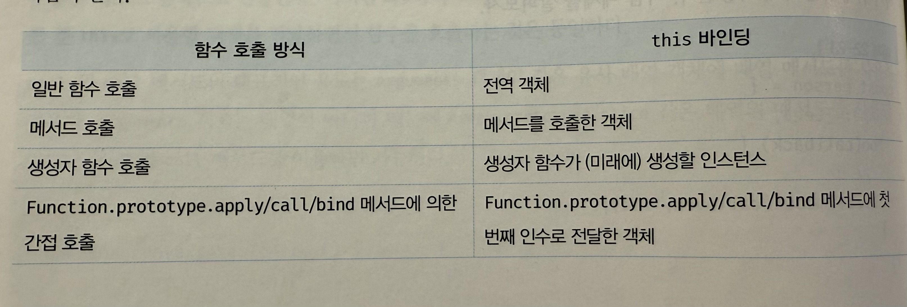

## this 키워드

- this는 자신이 속한 객체 또는 자신이 생성할 인스턴스를 가리키는 작디 참조 변수다. this를 통해 자신이 속한 객체 또는 자신이 생성할 인스턴스의 프로퍼티나 메서드를 참조할 수 있다.
- this가 가리키는 값, 즉 this바인딩은 함수 호출 방식에 의해 동적으로 결정된다.
- **객체 리터럴**의 메서드 내부에서의 this는 메서드를 호출한 객체, 즉 Circle을 가리킨다.

  ```
  cost Circle = {
      radius: 5,
      getDiameter(){
          // this는 메서드를 호출한 객체를 가리킨다.
          return 2 * this.radius;
      }
  }

  console.log(circle.getDiameter()); // 10
  ```

- **생성자 함수**에서의 this는 생성자 함수가 생성할 인스턴스를 가리킨다.

  ```
  function Circle(radius){
      // this는 생성자 함수가 생성할 인스턴스를 가리킨다.
      this.radius = radius;
  }

  Circle.prototype.getDiameter = function () {
      // this는 생성자 함수가 생성할 인스턴스를 가리킨다.
      return 2 * this.radius;
  };

  const circle = new Circle(5)
  console.log(circle.getDiameter()) // 10
  ```

## 함수 호출 방식과 this 바인딩

- this에 바인딩 될 값은 함수가 어떻게 호출되었는지에 따라 동적으로 결정된다.

### 일반 함수 호출

- 기본적으로 일반 함수에서의 `this`는 전역 객체가 바인딩된다.
- 참고로 strict mode에서는 this가 undefined로 설정된다.

  ```
  function foo() {
  console.log("foo's this: ", this); // window (브라우저 환경)
  function bar() {
      console.log("bar's this: ", this); // window (일반 함수이므로)
  }
  bar();
  }
  foo();
  ```

- **메서드 내부에서 정의된 중첩 함수도 일반 함수처럼 호출하면 this가 전역 객체를 참조**한다.

  ```
  var value = 1;

  const obj = {
  value: 100,
  foo() {
      console.log("foo's this: ", this); // { value: 100, foo: f }
      // 객체 리터럴로 호출한 메서드 내부에서 this는 메서드를 호출한 객체를 가리킴
      console.log("foo's this.value: ", this.value); // 100

      function bar() {
      console.log("bar's this: ", this); // window
      console.log("bar's this.value: ", this.value); // 1
      }

      bar();
  }
  };

  obj.foo();

  ```

- 콜백 함수가 일반 함수로 호출될 때도 콜백 함수 내의 this에도 전역 함수가 바인딩된다.

  ```
  var value = 1;

  const obj = {
  value: 100,
  foo() {
      console.log("foo's this: ", this); // { value: 100, foo: f }

      setTimeout(function () {
      console.log("callback's this: ", this); // window
      console.log("callback's this.value: ", this.value); // 1
      }, 100);
  }
  };

  obj.foo();

  ```

- this를 명시적으로 바인딩 하려면 아래처럼 방법을 우회할 수 있다.
  (1) that = this

  ```
  var value = 1;

  const obj = {
  value: 100,
  foo() {
      const that = this; // this를 that에 저장

      setTimeout(function () {
      console.log(that.value); // 100
      }, 100);
  }
  };

  obj.foo();

  ```

(2) bind() 적용

    ```
    var value = 1;

    const obj = {
    value: 100,
    foo() {
        setTimeout(
        function () {
            console.log(this.value); // 100
        }.bind(this), 100);
    }
    };

    obj.foo();
    ```

(3) 화살표 함수 사용

- 화살표 함수 내부의 this는 상위 스코프의 this를 가리킨다.

  ```
  var value = 1;

  const obj = {
  value: 100,
  foo() {
      setTimeout(() => {
      console.log(this.value); // 100
      }, 100);
  }
  };

  obj.foo();

  ```

### 메서드 호출

- 메서드 내부의 this는 메서드를 소유한 객체가 아닌 메서드를 호출한 객체에 바인딩된다.

  ```
  const person = {
  name: 'Lee',
  getName() {
      return this.name;
  }
  };

  // getName 메서드를 호출한 객체는 person이다.
  console.log(person.getName()); // "Lee"

  ```

- getName 메서드는 person 객체에 포함된 것이 아니라 독립적으로 존재하는 별도의 객체다. 따라서 메서드를 다른 객체에 할당하면 this가 바뀔 수 있다.

  ```
  const anotherPerson = {
  name: 'Kim'
  };

  // getName 메서드를 anotherPerson 객체의 메서드로 할당
  anotherPerson.getName = person.getName;

  console.log(anotherPerson.getName()); // "Kim"

  // getName 메서드를 일반 변수에 할당 후 호출
  const getName = person.getName;

  console.log(getName()); // ''(window.name -> 브라우저 창의 이름을 나타내는 빌트인 프로퍼티이며 기본값은 '')

  ```

- 프로토타입 메서드 내부에서 사용된 this도 일반 메서드와 마찬가지로 해당 메서드를 호출한 객체에 바인딩된다.

  ```
  function Person(name) {
  this.name = name;
  }

  Person.prototype.getName = function () {
  return this.name;
  };

  const me = new Person('Lee');

  // this는 me를 참조하여 'Lee'를 반환
  console.log(me.getName()); // "Lee"

  // 프로토타입 객체(Person.prototype)에 name 추가
  Person.prototype.name = 'Kim';

  // Person.prototype에 {name:'kim'}이 존재해서 얘를 getName이 this로 받는다
  // this가 Person.prototype을 가리킨다는 뜻
  console.log(Person.prototype.getName()); // "Kim"

  ```

### 생성자 함수 호출

- 생성자 함수 내부의 this는 생성될 인스턴스를 가리킨다.

  ```
  function Circle(radius) {
  this.radius = radius;
  this.getDiameter = function () {
      return 2 * this.radius;
  };
  }

  // 반지름이 5인 Circle 객체 생성
  const circle1 = new Circle(5);
  console.log(circle1.getDiameter()); // 10

  // 반지름이 10인 Circle 객체 생성
  const circle2 = new Circle(10);
  console.log(circle2.getDiameter()); // 20

  ```

- new 없이 생성자 함수를 호출하면 일반 함수처럼 실행되어 this가 전역객체를 참조하게 됨에 유의하자.

### Function.prototype.apply/call/bind 메서드에 의한 간접 호출

- apply, call, bind 메서드는 Function.prototype의 메서드다. 즉, 이들 메서드는 모든 함수가 상속받아 사용할 수 있다.
- apply(thisArg, [argsArray]): 함수 호출 시 this를 특정 객체로 바인딩하고 배열 형태로 인수를 전달한다
- call(thisArg, arg1, arg2, ...): 함수 호출 시 this를 특정 객체로 바인딩하고 개별 인수를 전달한다

  ```
  function getThisBinding() {
  return this;
  }

  const thisArg = { a: 1 };

  console.log(getThisBinding()); // window (또는 undefined in strict mode)

  console.log(getThisBinding.apply(thisArg)); // { a: 1 }
  console.log(getThisBinding.call(thisArg));  // { a: 1 }
  ```

- 다만 인수 전달 방식에 차이가 있다.

  ```
  function getThisBinding() {
  console.log(arguments);
  return this;
  }

  console.log(getThisBinding.apply(thisArg, [1, 2, 3]));
  console.log(getThisBinding.call(thisArg, 1, 2, 3));

  ```

- bind메서드는 apply와 call 메서드와 달리 함수를 호출하지 않으며 다만 첫 번째 인수로 전달한 값으로 this 바인딩이 교체된 함수를 새롭게 생성해 반환한다.

  ```
  function getThisBinding(){
      return this;
  }

  // this로 사용할 객체
  const thisArg = { a: 1};

  // bind 메서드는 첫 번째 인수로 전달한 thisArg로 this 바인딩이 교체된
  // getThisBinding 함수를 새롭게 생성해 반환한다.
  console.log(getThisBinding.bind(thisArg)); // getThisBinding
  // 함수를 명시적으로 호출해야 한다.
  console.log(getThisBinding.bind(thisArg)()); // {a:1}
  ```

- bind는 콜백 함수의 this가 불일치하는 문제를 해결할때 용이하다.(위에서 언급)
- 정리:
  
