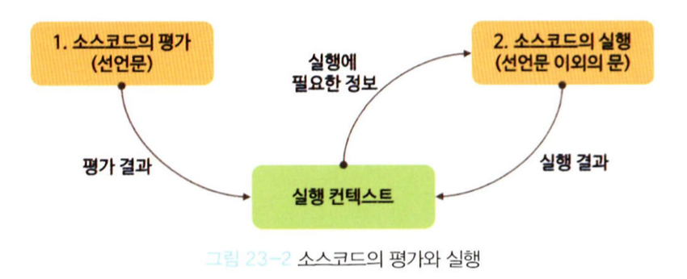
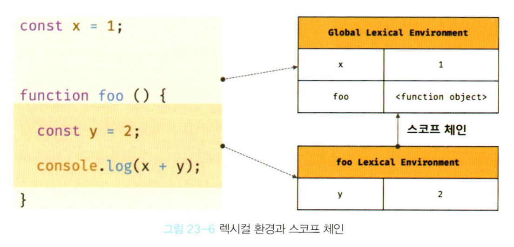
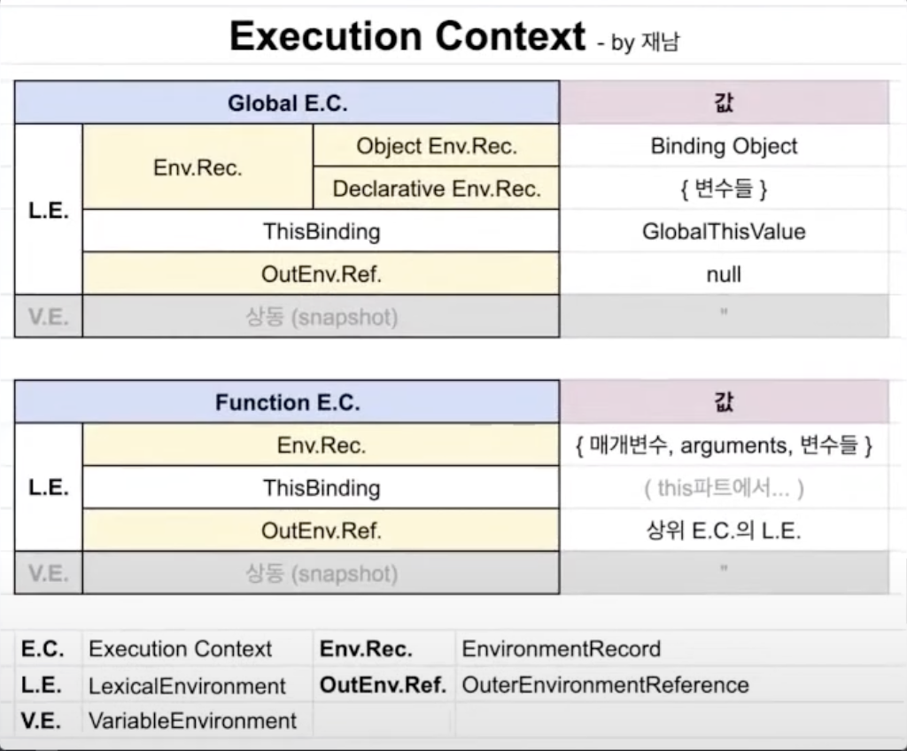
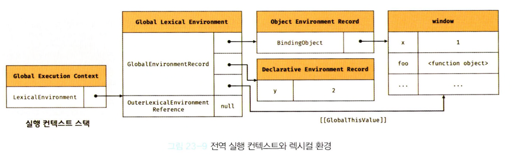
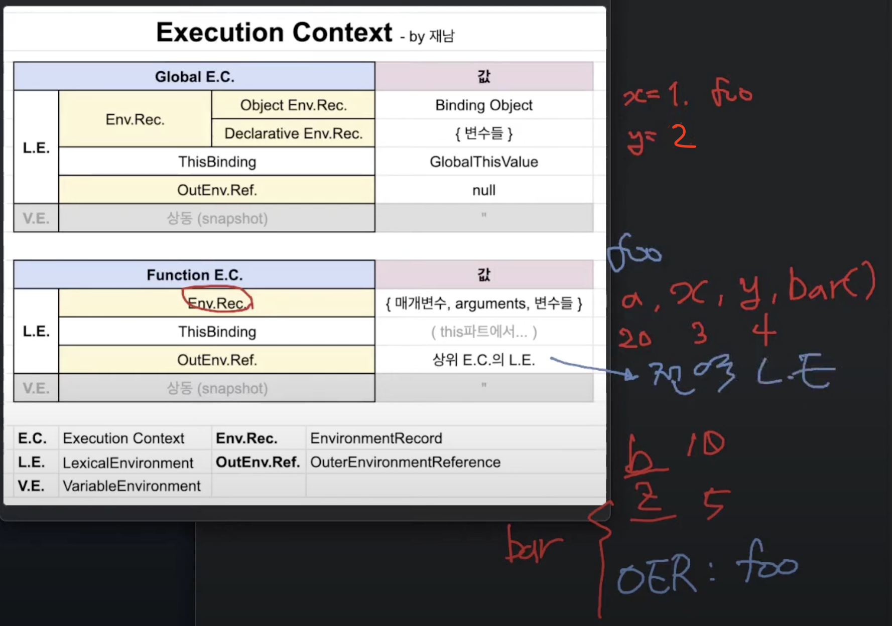

## 23.1 소스코드의 타입
- 4가지 타입의 소스코드를 평가하여 실행 컨텍스트를 생성한다.
  - 전역 코드 ---> 전역 실행 컨텍스트
  - 함수 코드 ---> 함수 실행 컨텍스트
  - eval 코드 ---> eval 실행 컨텍스트
  - 모듈 코드 ---> 모듈 실행 컨텍스트

## 23.2 소스코드의 평가와 실행
- 소스코드 평가
  - 실행 컨텍스트를 생성
  - 변수, 함수 등의 선언문만 먼저 실행하여 생성된 변수나 함수 식별자를 키로 실행 컨텍스트가 관리하는 스코프(렉시컬 환경의 환경 레코드)에 등록
- 소스코드 실행
  - 선언문을 제외한 소스코드가 순차적으로 실행
  - 소스코드 실행에 필요한 정보(변수나 함수의 참조)를 실행 컨텍스트가 관리하는 스코프에서 검색하여 취득
  - 소스코드의 실행 결과(변수 값의 변경 등)는 다시 실행 컨텍스트가 관리하는 스코프에 등록


## 23.3 실행 컨텍스트의 역할
- 실행 컨텍스트는 소스코드를 실행하는 데 필요한 환경을 제공하고 코드의 실행 결과를 실제로 관리하는 영역이다.
- 실행 컨텍스트는 식별자를 등록하고 관리하는 스코프와 코드 실행 순서 관리를 구현한 내부 메커니즘으로, 모든 코드는 실행 컨텍스트를 통해 실행되고 관리된다.
- 식별자와 스코프 => 실행 컨텍스트의 렉시컬 환경으로 관리
- 코드 실행 순서 => 실행 컨텍스트 스택으로 관리

## 23.4 실행 컨텍스트 스택
```
const x = 1;

function foo() {
  const y = 2;

  function bar() {
    const z = 3;
    console.log(x + y + z);
  }
  bar();
}

foo();
```

- 실행 컨텍스트 스택은 코드 실행 순서를 관리한다.
- 실행 컨텍스트 스택의 최상위에 존재하는 실행 컨텍스트는 언제나 현재 실행 중인 코드의 실행 컨텍스트다.

## 23.5 렉시컬 환경
- 렉시컬 환경은 스코프와 식별자를 관리한다.

- 실행 컨텍스트는 LexicalEnvironment 컴포넌트와 VariableEnvironment 컴포넌트로 구성된다.
- 렉시컬 환경은 두 개의 컴포넌트로 구성된다.
  1. 환경 레코드 (Environment Record)
    - 스코프에 포함된 식별자를 등록하고 등록된 식별자에 바인딩된 값을 관리하는 저장소
  2. 외부 렉시컬 환경에 대한 참조 (Outer Lexical Environment Reference)
    - 외부 렉시컬 환경에 대한 참조는 상위 스코프를 가리킨다.


## 23.6 실행 컨텍스트의 생성과 식별자 검색 과정
```
var x = 1;
const y = 2;

function foo(a) {
  var x = 3;
  const y = 4;

  function bar(b) {
    const z = 5;
    console.log(a + b + x + y + z);
  }
  bar(10);
}

foo(20); // 42
```

### 23.6.1 전역 객체 생성
- 전역 객체는 전역 코드가 평가되기 이전에 생성된다.

### 23.6.2 전역 코드 평가
- 전역 코드 평가는 다음과 같은 순서로 진행된다.
  1. 전역 실행 컨텍스트 생성
  2. 전역 렉시컬 환경 생성<br/>
    2.1. 전역 환경 레코드 생성<br/>
      &nbsp;&nbsp;&nbsp;&nbsp;2.1.1. 객체 환경 레코드 생성<br/>
      &nbsp;&nbsp;&nbsp;&nbsp;2.1.2. 선언적 환경 레코드 생성<br/>
    2.2. this 바인딩<br/>
    2.3. 외부 렉시컬 환경에 대한 참조 결정<br/>


  #### 1. 전역 실행 컨텍스트 생성
  - 비어있는 전역 실행 컨텍스트를 생성하여 실행 컨텍스트 스택에 푸시한다.
  - 전역 실행 컨텍스트는 실행 컨텍스트 스택의 최상위(실행 중인 실행 컨텍스트)가 된다.

  #### 2. 전역 렉시컬 환경 생성
  ##### 2.1 전역 환경 레코드 생성
  - 전역 환경 레코드는 객체 환경 레코드와 선언적 환경 레코드로 구성되어 있다.
    - 객체 환경 레코드: var 키워드로 선언한 전역 변수, 함수 선언문으로 정의한 전역 함수, 빌트인 전역 프로퍼티와 빌트인 전역 함수, 표준 빌트인 객체 관리
    - 선언전 환경 레코드: let, const 키워드로 선언한 전역 변수 관리
    ###### 2.1.1 객체 환경 레코드 생성
    - BindingObject는 전역 객체 생성(23.6.1)에서 생성된 전역 객체다.
    - 전역 코드 평가 과정에서 var 키워드로 선안한 전역 변수와 함수 선언문으로 정의된 전역 함수는 BindingObject를 통해 전역 객체의 프로퍼티와 메서드가 된다.
    - var 키워드로 선언한 함수는 호이스팅 된 후 undefined로 초기화되기 때문에 변수 선언문 이전에도 참조할 수 있다.
    - 함수 선언문은 완전히 호이스팅 되어 함수 선언문 이전에 호출할 수 있다.
    ###### 2.1.2 선언적 환경 레코드 생성
    - let, const 키워드로 선언한 전역 변수(let, const 키워드로 선언한 변수에 할당한 함수 표현식 포함)는 선언적 환경 레코드에 등록되고 관리된다.
    - let, const 키워드로 선언한 변수는 선언만 호이스팅되고, 초기화는 호이스팅되지 않는다. 따라서 변수 선언문에 도달하기 전까지 일시적 사각지대에 빠지기 때문에 참조할 수 없다.

  ##### 2.2 this 바인딩
  - 전역 환경 레코드의 [[GlobalThisValue]] 내부 슬롯에 this가 바인딩된다. 일반적으로 전역 코드에서 this는 전역 객체를 가리키므로 전역 환경 레코드의 [[GlobalThisValue]] 내부 슬롯에는 전역 객체가 바인딩된다.

  ##### 2.3 외부 렉시컬 환경에 대한 참조 결정
  - 외부 렉시컬 환경에 대한 참조는 현재 평가 중인 소스코드를 포함하는 외부 소스코드의 렉시컬 환경, 즉 상위 스코프를 가리킨다.
  - 전역 코드를 포함하는 소스코드는 없으므로 전역 렉시컬 환경의 외부 렉시컬 환경에 대한 참조에 null이 할당된다.

### 23.6.3 전역 코드 실행
- 변수 할당문이 실행되어 전역 변수 x, y에 값이 할당되고, foo 함수가 호출된다.
- 동일한 이름의 식별자가 다른 스코프에 여러 개 존재할 경우 어느 스코프의 식별자를 참조하면 되는지 결정이 필요하다. 식별자 결정을 위해 식별자를 검색할 때는 실행중인 실행 컨텍스트에서 식별자를 검색하기 시작한다.

### 23.6.4 foo 함수 코드 평가
### 23.6.5 foo 함수 코드 실행
### 23.6.6 bar 함수 코드 평가
### 23.6.7 bar 함수 코드 실행
### 23.6.8 bar 함수 코드 실행 종료
### 23.6.9 foo 함수 코드 실행 종료
### 23.6.10 전역 코드 실행 종료


## 23.7 실행 컨텍스트와 블록 레벨 스코프
```
let x = 1;
if(true) {
  let x = 10;
  console.log(x); // 10
}
console.log(x); // 1
```
- if문의 코드 블록이 실행되면 if문의 코드 블록을 위한 블록 레벨 스코프를 생성하기 위해 선언적 환경 레코드를 갖는 렉시컬 환경을 새롭게 생성하여 기존의 전역 렉시컬 환경을 교체한다.
- if문 코드 블록의 실행이 종료되면 if문의 코드 블록이 실행되기 이전의 렉시컬 환경으로 되돌린다.
