 # 클로저
 - ECMAScipt 사양에서 정의된 클로저의 내용이 책에 있는 내용과 달리 현재 바뀌었다.
 https://developer.mozilla.org/ko/docs/Web/JavaScript/Guide/Closures
 `클로저는 주변 상태(어휘적 환경)에 대한 참조와 함께 묶인(포함된) 함수의 조합이다. 바꿔말하면 클로저는 내부 함수로부터 외부 함수에의 접근 권한을 준다. JavaScript에서 클로저는 함수 생성 시 함수가 생성될 때마다 생성된다.`
 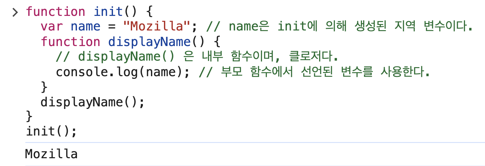


 ## 렉시컬 스코프
 - 자바스크립트 엔진은 함수를 어디서 호출했는지가 아니라 함수를 어디에 정의했는지에 따라 상위 스코프를 결정한다. 이를 렉시컬 스코프라 한다.

     ```
    const x = 1;
    function foo() {
        const x = 10;
        bar(); // 여기서 bar를 호출했다고 해서 x=10에 접근할 수 있는 것은 아니다.
    }
    function bar() {
        console.log(x)
    }
    foo(); // ?
    bar(); // ?

    ```
    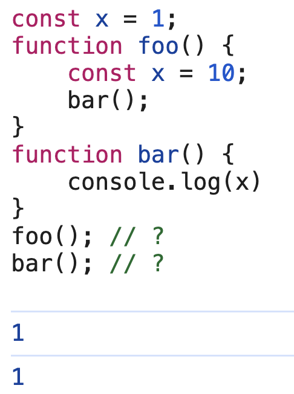


 ## 함수 객체의 내부 슬롯 [[Environment]]
 - 함수는 자신의 내부 슬롯 [[Environment]]에 상위 스코프의  정보를 저장한다. 

    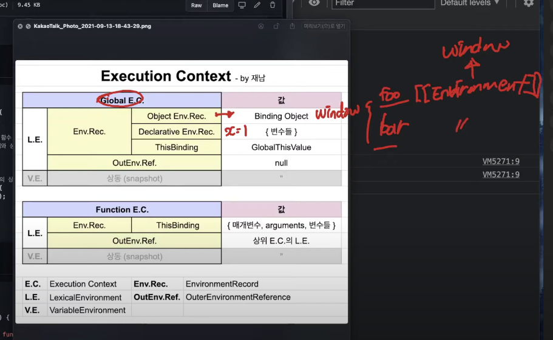

    - 함수 foo와 bar는 전역 실행 컨텍스트 안에서 정의되므로, 그 생성 시점의 렉시컬 환경(즉, 전역 렉시컬 환경)을 [[Environment]] 슬롯에 저장하게 된다. 이 전역 렉시컬 환경은 window 객체를 바인딩 오브젝트로 포함하고 있기 때문에, bar 내부에서 참조하는 x는 결국 window.x, 즉 전역 변수 x를 참조하게 된다.

## 클로저와 렉시컬 환경
- 외부 함수보다 중첩 함수가 더 오래 유지되는 경우 중첩 함수는 이미 생명 주기가 종료한 외부 함수의 변수를 참조할 수 있다. 이러한 중첩 함수를 `클로저`라고 부른다. 

    ```
    const x = 1;

    // 1
    function outer() {
        const x = 10;
        const inner = function () { console.log(x);}; //2
        return inner;
    }

    // outer 함수를 호출하면 중첩 함수 inner를 반환한다.
    // 그리고 outer 함수의 실행 컨텏그트는 실행 컨텍스트 스택에서 팝되어 제거된다.
    const innerFunc = outer(); //3
    innerFunc(); //4 10
    ```
    - 3번에서는 inner 함수가 return되는 시점이다. 이때 inner의 [[Environment]]에는 outer의 L.E가 담겨있다. 따라서 outer의 생명주기가 이미 끝났어도 outer의 x를 inner가 계속 참조할 수 있다. 
    - 이에 outer 함수의 실행 컨텍스트는 실행 컨텍스트 스택에서 제거되지만 outer 함수의 렉시컬 환경까지 소멸하는 것은 아니라고 할 수 있다. inner 함수에 의해 참조되고 있어서 가비지 컬렉션의 대상이 되지 않기 때문이다.

- 일반적으로 모든 함수를 클로저라고 하지는 않는다.
    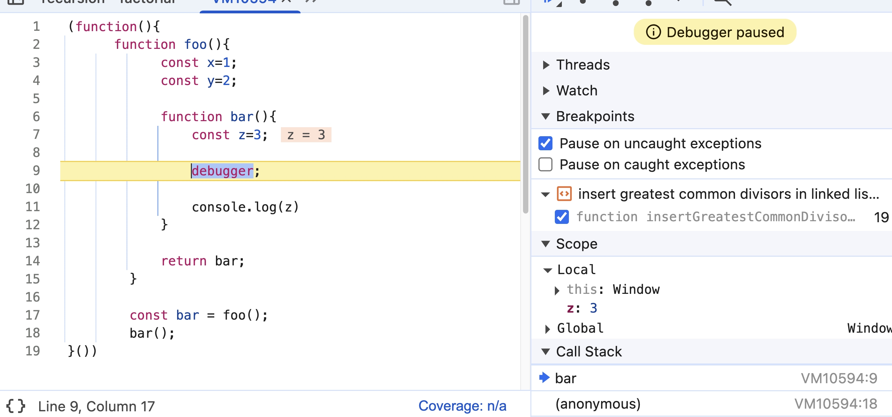
        - 상위 스코프의 어떠한 식별자도 참조하지 않는 경우.
    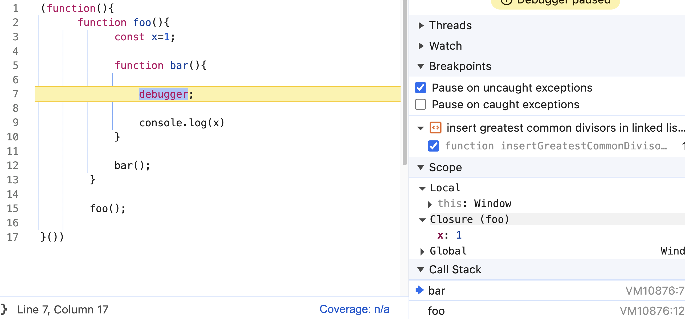
        - 외부 함수 foo보다 중첩 함수 bar의 생명 주기가 짧은 경우
        -  bar가 foo의 렉시컬 환경에 접근하긴 했지만, 그건 foo가 아직 살아 있을 때였음
        - bar는 foo보다 먼저 종료됨 - "소멸된 외부 함수의 변수에 접근한다"는 진짜 클로저 특유의 상황은 아님
- 클로저는 중첩 함수가 상위 스코프의 식별자를 참조하고 있고 중첩 함수가 외부 함수보다 더 오래 유지되는 경우에 한정하는 것이 일반적
- 클로저에 의해 참조되는 상위 스코프의 변수(위 예제에서 foo함수의 x변수)를 자유 변수라고 부름

## 클로저의 활용
- 클로저는 상태가 의도치 않게 변경되지 않도록 안전하게 은닉하고 특정 함수에게만 상태 변경을 허용하여 상태를 안전하게 변경하고 유지하기 위해 사용한다.
    ```
    // 카운트 상태 변경 함수
    const increase = (function () {
        // 카운트 상태 변수
        let num = 0;
        // 클로저
        return function () {
            // 카운트 상태를 1만큼 증가시킨다.
            return ++num;
        }
    }())

    console.log(increase()); //1
    console.log(increase()); //2
    console.log(increase()); //3
    ```
    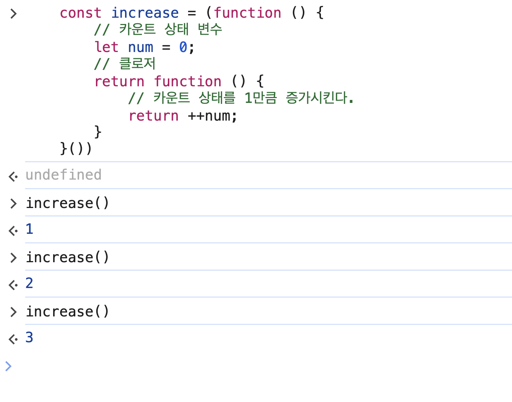
    - num은 외부에서 접근 못해서 은닉된 변수
    - 특정 함수(increase)를 사용해야만 상태 변경이 가능

    ## 캡슐화와 정보 은닉
    - 캡슐화는 객체의 상태를 나타내는 프로퍼티와 프로퍼티를 참조하고 조작할 수 있는 동작인 메서드를 하나로 묶는 것을 말한다.
    - 캡슐화는 객체의 특정 프로퍼티나 메서드를 갑출 목적으로 사용하기도 하는데 이를 정보 은닉이라 한다. 
    - 자바스크립트 객체의 모든 프로퍼티와 메서드는 기본적으로 public하다. public, private, protected 같은 접근 제한자를 제공하지 않는다.
    - 그런데 2021년에 private 필드를 정의할 수 있는 새로운 표준 사양에 제안되었다고 한다. 변수 앞에 #을 붙이면 된다.
    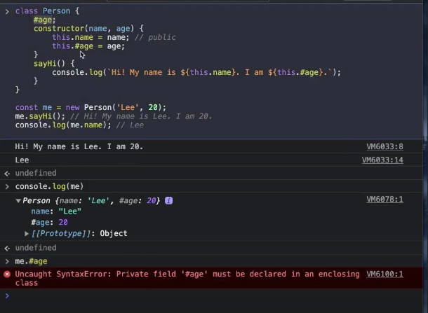

    ## 자주 발생하는 실수
    - 아래는 클로저를 사용할 때 발생하는 잘못된 예시이다. 
        ```
        var funcs = [];
        for (var i=0; i<3; i++){
            funcs[i] = function() {return i++}; 
        }
        for(var j=0; j<funcs.length; j++){
            console.log(funcs[j]());
        }
        ```
        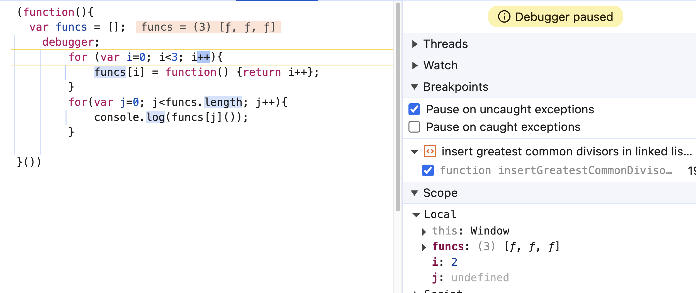
        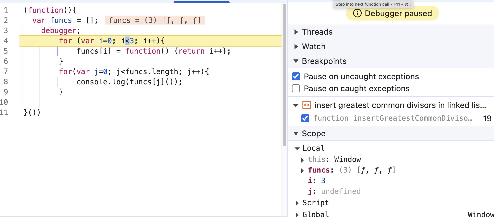
        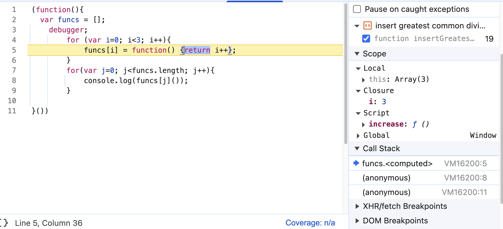
        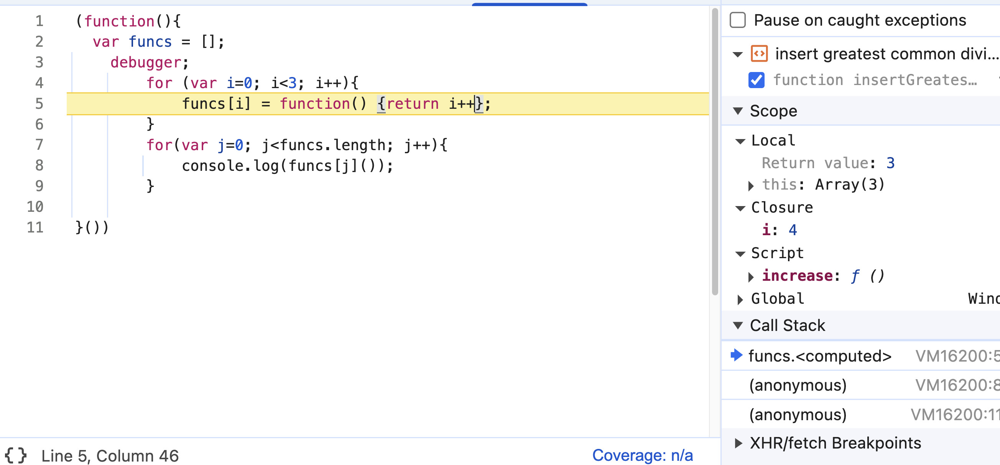

        - return i 에서 0,1,2가 되길 기대하겠지만(기대 안함..) i는 전역 컨텍스트 i를 참조하여 3부터 return한다.

        ```
        var funcs = [];
        
        for (var i=0; i<3; i++){
            funcs[i] = ( function(id) {
                return function(){
                    return id;
                };
            }(i));
        }
        
        for(var j=0; j<funcs.length; j++){
            console.log(funcs[j]());
        }
        ```

    - 클로저를 사용해 위 예제를 바르게 동작하는 코드로 만들 수 있다. 누가 이렇게 하죠!?
    - 즉시 실행함수에 인자 i를 넘겨서 i가 0인 클로저 하나, i가 1인 클로저 하나, i가 2인 클로저 하나 이렇게 만들 수 있다.

    - 간단하게 let을 사용하면 블록 스코프 내에서만 적용되므로 문제가 해결된다.