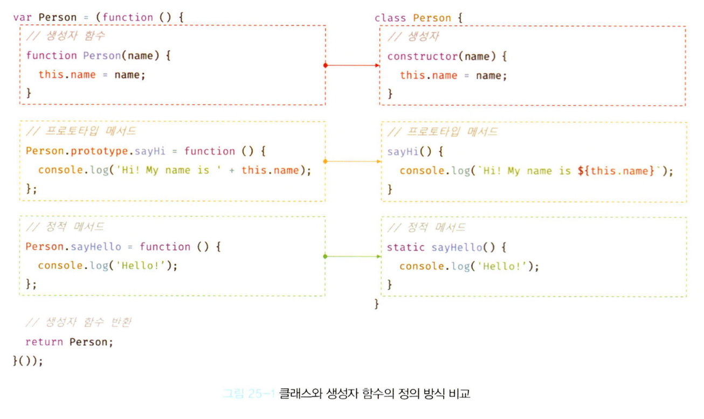

## 25.1 클래스는 프로토타입의 문법적 설탕인가?
- 자바스크립트는 프로토타입 기반 객체지향 언어다.
- 프로토타입 기반 객체지향 언어는 클래스가 필요 없는 객체지향 프로그래밍 언어다.
- 자바나 C#과 같은 클래스 기반 객체지향 프로그래밍에 익숙한 프로그래머가 더욱 빠르게 학습할 수 있도록 ES6에서는 클래스 기반 객체지향 프로그래밍 언어와 매우 흡사한 새로운 객체 생성 메커니즘을 제시했다.
- 클래스와 생성자 함수의 차이
  1. 클래스: new 연산자 없이 호출하면 에러 발생
  생성자 함수: new 연산자 없이 호출하면 일반 함수로서 호출됨
  2. 클래스: 상속을 지원하는 extends와 super 키워드를 제공
  생성자 함수: 제공 X
  3. 클래스: 호이스팅이 발생하지 않는 것처럼 동작
  생성자 함수:  함수 선언문으로 정의된 생성자 함수는 함수 호이스팅이, 함수 표현식으로 정의한 생성자 함수는 변수 호이스팅이 발생
  4. 클래스: 클래스 내의 모든 코드에는 암묵적으로 strict mode가 지정되어 실행되며 strict mode를 해제할 수 없음
  생성자 함수: 암묵적으로 지정되지 않음
  5. 클래스의 constructor, 프로토타입 메서드, 정적 메서드는 모두 프로퍼티 어트리뷰트 [[Enumerable]]의 값이 false이므로 열거되지 않음
-  클래스를 프로토타입 기반 객체 생성 패턴의 단순한 문법적 설탕이라고 보기보다는 새로운 객체 생성 메커니즘으로 보는 것이 좀 더 합당하다.

## 25.2 클래스 정의
- 클래스는 class 키워드를 사용하여 정의하며, 클래스 이름은 생성자 함수와 마찬가지로 파스칼 케이스를 사용하는 것이 일반적이다.
- 클래스 몸체에는 0개 이상의 메서드만 정의할 수 있으며, 정의할 수 있는 메서드는 constructor(생성자), 프로토타입 메서드, 정적 메서드 세 가지가 있다.
  ```
  // 클래스 선언문
  class Person {
    // 생성자
    constructor(name) {
      this.name = name;
    }
    
    // 프로토타입 메서드
    sayHi() {
      console.log(`Hi! My name is ${this.name}`)
    }
    
    // 정적 메서드
    static sayHello() {
      console.log('Hello!');
    }
  }

  const me = new Person('Lee');
  console.log(me.name); // Lee 
  me.sayHi( ); // Hi! My name is Lee
  Person.sayHello(); // Hello!
  ```



## 25.3 클래스 호이스팅
- 클래스는 클래스 정의 이전에 참조할 수 없다.
- 클래스는 let, const 키워드로 선언한 변수처럼 호이스팅 된다. 따라서 클래스 선언문 이전에 일시적 사각지대에 빠지기 때문에 호이스팅이 발생하지 않는 것처럼 동작한다.
  ```
  const Person = '';
  {
    // 호이스팅이 발생하지 않는다면 ''이 출력되어야 한다.
    console.log(Person);
    // ReferenceError: Cannot access 'Person' before initialization

    // 클래스 선언문
    class Person {}
  }
  ```

## 25.4 인스턴스 생성
- 함수는 new 연산자의 사용 여부에 따라 일반 함수로 호출되거나 인스턴스 생성을 위한 생성자 함수로 호출되지만, 클래스는 인스턴스를 생성하는 것이 유일한 존재 이유이므로 반드시 new 연산자와 함께 호출해야 한다.
  ```
  class Person {}

  const me = new Person();
  console.log(me); // Person {}
  ```
  ```
  class Person {}

  const me = Person(); 
  // TypeError: Class constructor Person cannot be invoked without 'new'
  ```

## 25.5 메서드
- 클래스 몸체에서 정의할 수 있는 메서드는 constructor, 프로토타입 메서드, 정적 메서드 세 가지가 있다.

### 25.5.1 constructor
- constructor는 인스턴스를 생성하고 초기화하기 위한 특수한 메서드다.
- 클래스는 인스턴스를 생성하기 위한 생성자 함수다.
  ```
  class Person {
    constructor(name) {
      this.name = name;
    }
  }

  // 클래스는 함수다
  console.log(typeof Person); // function
  ```
- 생성자 함수와 마찬가지로 constructor 내부에서 this에 추가한 프로퍼티는 인스턴스 프로퍼티가 된다.
- constructor는 클래스 내에 최대 한 개만 존재할 수 있다.
- constructor는 생략할 수 있으며, 생략하면 클래스에 빈 constructor가 암묵적으로 정의된다.
- 프로퍼티가 추가되어 초기화된 인스턴스를 생성하려면 constructor 내부에서 this에 인스턴스 프로퍼티를 추가한다.
  ```
  class Person {
    constructor() {
      this.name = 'Lee';
      this.name = 'Seoul';
    }
  }

  const me = new Person();
  console.log(me); // Person {name: "Lee", address: "Seoul"}
  ```
- 인스턴스를 생성할 때 클래스 외부에서 인스턴스 프로퍼티의 초기값을 전달하려면 constructor에 매개변수를 선언하고 인스턴스를 생성할 때 초기값을 전달한다.
  ```
  class Person {
    constructor(name, address) {
      this.name = name;
      this.address = address;
    }
  }

  const me = new Person('Lee', 'Seoul');
  console.log(me); // Person {name: "Lee", address: "Seoul"}
  ```
- new 연산자와 함께 클래스가 호출되면 암묵적으로 this, 즉 인스턴스를 반환하기 때문에 constructor는 별도의 반환문을 갖지 않아야 한다. 만약 this가 아닌 다른 객체를 명시적으로 반환하면 인스턴스가 반환되지 못하고 return문에 명시한 객체가 반환된다.
  ```
  class Person {
    constructor(name) {
      this.name = name;

      return {};
    }
  }

  const me = new Person('Lee');
  console.log(me); // {}
  ```
- constructor 내부에서 명시적으로 this가 아닌 다른 값을 반환하는 것은 클래스의 기본 동작을 훼손하므로 return문은 반드시 생략해야 한다.

### 25.5.2 프로토타입 메서드
- 클래스 몸체에서 정의한 메서드는 클래스의 prototype 프로퍼티에 메서드를 추가하지 않아도 기본적으로 프로토타입 메서드가 된다.
- 클래스는 생성자 함수와 마찬가지로 프로토타입 기반의 객체 생성 메커니즘이다.
  ```
  class Person {
    constructor(name) {
      this.name = name;
    }

    sayHi() {
      console.log(`Hi! My name is ${this.name}`);
    }
  }

  const me = new Person('Lee');
  me.sayHi(); // Hi! My name is Lee
  ```

### 25.5.3 정적 메서드
- 정적 메서드는 인스턴스를 생성하지 않아도 호출할 수 있는 메서드를 말한다.
- 클래스에서는 메서드에 static 키워드를 붙이면 정적 메서드(클래스 메서드)가 된다.
- 정적 메서드는 프로토타입 메서드처럼 인스턴스로 호출하지 않고 클래스로 호출한다.
  ```
  class Person {
    constructor(name) {
      this.name = name;
    }

    // 정적 메서드
    static sayHi() {
      console.log('Hi!');
    }
  }

  Person.sayHi(); // Hi!
  ```

### 25.5.4 정적 메서드와 프로토타입 메서드의 차이
1. 정적 메서드와 프로토타입 메서드는 자신이 속해 있는 프로토타입 체인이 다르다.
2. 정적 메서드는 클래스로 호출하고 프로토타입 메서드는 인스턴스로 호출한다.
3. 정적 메서드는 인스턴스 프로퍼티를 참조할 수 없지만 프로토타입 메서드는 인스턴스 프로퍼티를 참조할 수 있다.

- 메서드 내부에서 인스턴스 프로퍼티를 참조할 필요가 있다면 this를 사용해야 하며, 이러한 경우 프로토타입 메서드로 정의해야 한다.
- this를 사용하지 않는 메서드는 정적 메서드로 정의하는 것이 좋다.
- 표준 빌트인 객체인 Math, Number, JSON, Object 등은 다양한 정적 메서드를 가지고 있다. 클래스 또는 생성자 함수를 하나의 네임스페이스로 사용하여 정적 메서드를 모아 놓으면 이름 충돌 가능성을 줄여주고 관련 함수들을 구조화할 수 있는 효과가 있다.

## 25.6 클래스의 인스턴스 생성 과정
```
class Person {
  constructor(name) {
    // 1. 암묵적으로 인스턴스가 생성되고 this에 바인딩된다.
    console.log(this); // Person {}
    console.log(Object.getPrototypeOf(this) === Person.prototype); // true

    // 2. this에 바인딩되어 있는 인스턴스를 초기화한다.
    this.name = name;

    // 3. 완성된 인스턴스가 바인딩된 this가 암묵적으로 반환된다.
  }
}
```


## 25.8 상속에 의한 클래스 확장
### 25.8.1 클래스 상속과 생성자 함수 상속
- 클래스는 상속을 통해 다른 클래스를 확장할 수 있는 문법인 extends 키워드가 기본적으로 제공되지만 생성자함수는 제공되지 않는다.
```
class Animal {
  constructor(age, weight) {
    this.age = age;
    this.weight = weight;
  }
  eat() { return 'eat'; }
  move() { return 'move'; }
}

// 상속을 통해 Animal 클래스를 확장한 Bird 클래스
class Bird extends Animal {
  fly() { return 'fly'; }
}

const bird = new Bird(1, 5);

console.log(bird); // Bird {age: 1, weight: 5}
console.log(bird instanceof Bird); // true
console.log(bird instanceof Animal); // true

console.log(bird.eat()); // eat
console.log(bird.move()); // move
console.log(bird.fly()); // fly
```
- Bird 클래스는 상속을 통해 Animal 클래스의 속성을 그대로 사용하고 자신만의 고유한 속성을 추가하여 확장했다. 이처럼 상속에 의한 클래스 확장은 코드 재사용 관점에서 매우 유용하다.

## 25.8.2 extends 키워드
- 상속을 통해 클래스를 확장하려면 extends 키워드를 사용하여 상속받을 클래스를 정의한다.
- 상속을 통해 확장된 클래스를 서브클래스, 서브클래스에게 상속된 클래스를 수퍼클래스라 부른다.
  ```
  // 수퍼(베이스/부모)클래스
  class Base {}

  // 서브(파생/자식)클래스
  class Derived extends Base {}
  ```

## 25.8.3 동적 상속
- extends 키워드는 클래스뿐만 아니라 생성자 함수를 상속받아 클래스를 확장할 수도 있다. 단, extends 키워드 앞에는 반드시 클래스가 와야한다.
  ```
  function Base(a) {
    this.a = a;
  }

  // 생성자 함수를 상속받는 서브클래스
  class Derived extends Base() {}

  const derived = new Derived(1);
  console.log(derived); // Derived {a: 1}
  ```
- extends 키워드 다음에는 클래스뿐만 아니라 [[Construct]] 내부 메서드를 갖는 함수 객체로 평가될 수 있는 모든 표현식을 사용하여 동적으로 상속받을 대상을 결정할 수 있다.
  ```
  function Base1() {}

  class Base2 {}

  let condition = true;

  class Derived extends (condition ? Base1 : Base2) {}

  const derived = new Derived();
  console.log(derived); // Derived {}

  console.log(derived instanceof Base1); // true
  console.log(derived instanceof Base2); // false
  ```

### 25.8.4 서브클래스의 constructor
- 클래스에서 constructor를 생략하면 비어있는 constructor가 암묵적으로 정의된다.
  ```
  // 수퍼클래스
  class Base {}

  // 서브클래스
  class Derived extends Base {}
  ```
- 수퍼클래스와 서브클래스 모두 constructor를 생략하면 아래와 같이 암묵적으로 constructor가 정의된다.
  ```
  // 수퍼클래스
  class Base {
    constructor() {}
  }

  // 서브클래스
  class Derived extends Base {
    constructor(...args) { super(...args); }
  }

  const derived = new Derived();
  ```

### 25.8.5 super 키워드
- super 키워드는 함수처럼 호출할 수도 있고 this와 같이 식별자처럼 참조할 수 있는 특수한 키워드다.

  #### super 호출
  - super를 호출하면 수퍼클래스의 construtor(super-constructor)를 호출한다.
  - 수퍼클래스의 constructor 내부에서 추가한 프로퍼티를 그대로 갖는 인스턴스를 생성한다면 서브클래스의 constructor를 생략할 수 있다.
    ```
    // 수퍼클래스
    class Base {
      constructor(a, b) {
        this.a = a;
        this.b = b;
      }
    }

    // 서브클래스
    class Derived extends Base {
      // 암묵적으로 constructor가 정의된다.
      // constructor(...args) { super(...args); }
    }

    const derived = new Derived(1, 2);
    console.log(derived); // Derived {a: 1, b: 2}
    ```
  - 수퍼클래스에서 추가한 프로퍼티와 서브클래스에서 추가한 프로퍼티를 갖는 인스턴스를 생성한다면 서브클래스의 constructor를 생략할 수 없다.
    ```
    // 수퍼클래스
    class Base {
      constructor(a, b) {
        this.a = a;
        this.b = b;
      }
    }

    // 서브클래스
    class Derived extends Base {
      constructor(a, b, c) {
        super(a, b);
        this.c = c;  
      }
    }

    const derived = new Derived(1, 2, 3);
    console.log(derived); // Derived {a: 1, b: 2, c: 3}
    ```
  - super를 호출할 때 주의사항
    1. 서브클래스에서 constructor를 생략하지 않는 경우 서브클래스의 constructor에서는 반드시 super를 호출해야한다.
    2. 서브클래스의 constructor에서 super를 호출하기 전에는 this를 참조할 수 없다.
    3. super는 반드시 서브클래스의 constructor에서만 호출한다. 서브클래스가 아닌 클래스의 constructor나 함수에서 super를 호출하면 에러가 발생한다.
  
  #### super 참조
  - 메서드 내에서 super를 참조하면 수퍼클래스의 메서드를 호출할 수 있다.
    1. 서브클래스의 프로토타입 메서드 내에서 super.sayHi는 수퍼클래스의 프로토타입 메서드 sayHi를 가리킨다.
        ```
        // 수퍼클래스
        class Base {
          constructor(name) {
            this.name = name;
          }
          sayHi() {
            return `Hi! ${this.name}`;
          }
        }

        // 서브클래스
        class Derived extends Base {
          sayHi() {
            return `${super.sayHi()}. how are you doing?`;
          }
        }

        const derived = new Derived('Lee');
        console.log(derived.sayHi()); // Hi! Lee. how are you doing?
        ```
    2. 서브클래스의 정적 메서드 내에서 super.sayHi는 수퍼클래스의 정적 메서드 sayHi를 가리킨다.
        ```
        // 수퍼클래스
        class Base {
          static sayHi() {
            return 'Hi!';
          }
        }

        // 서브클래스
        class Derived extends Base {
          static sayHi() {
            return `${super.sayHi()} how are you doing?`;
          }
        }

        console.log(Derived.sayHi()); // Hi! how are you doing?
        ```
### 25.8.6 상속 클래스의 인스턴스 생성 과정
```
// 수퍼클래스
class Rectangle {
  constructor(width, height) {
    this.width = width;
    this.height = height;
  }
}
getArea() {
  return this.width * this.height;
}
toString() {
  return `width = ${this.width}, height = ${this.height}`;
}

// 서브클래스
class ColorRectangle extends Rectangle {
  constructor(width, height, color) {
    super(width, height);
    this.color = color;
  }

  // 메서드 오버라이딩
  toString() {
    return super.toString() + `, color = ${this.color}`;
  }
}

const colorRectangle = new ColorRectangle(2, 4, 'red');
console.log(colorRectangle); // ColorRectangle { width: 2, height: 4, color: "red" }

console.log(colorRectangle.getArea()); // 8
console.log(colorRectangle.toString()); // width = 2, height = 4, color = red
```
1. 서브클래스의 super 호출
  - 다른 클래스를 상속받지 않는 클래스는 new 연산자와 함께 호출되었을 때 암묵적으로 빈 객체, 즉 인스턴스를 생성하고 이를 this에 바인딩한다.
  - 서브클래스는 자신이 직접 인스턴스를 생성하지 않고 수퍼클래스에게 인스턴스 생성을 위임한다. 이것이 서브클래스의 constructor에서 반드시 super를 호출해야 하는 이유다.
2. 수퍼클래스의 인스턴스 생성과 this 바인딩
  - 수퍼클래스의 constructor 내부의 코드가 실행되기 이전에 암묵적으로 빈 객체(인스턴스)를 생성하고 this에 바인딩된다.
  - 인스턴스는 수퍼클래스가 생성한 것이지만 new 연산자와 함꼐 호출된 클래스는 서브클래스이므로 인스턴스는 new.target이 가리키는 서브클래스가 생성한 것으로 처리된다.
3. 수퍼클래스의 인스턴스 초기화
  - this에 바인딩 되어 있는 인스턴스에 프로퍼티를 추가하고 constructor가 인수로 전달받은 초기값으로 인스턴스의 프로퍼티를 초기화한다.
4. 서브클래스의 constructor로의 복귀와 this 바인딩
  - super의 호출이 종료되고 제어 흐름이 서브클래스 constructor로 돌아온다. 서브클래스는 별도의 인스턴스를 생성하지 않고 super가 반환한 인스턴스를 this에 바인딩하여 그대로 사용한다.
  - super가 호출되지 않으면 인스턴스가 생성되지 않으며, this 바인딩도 할 수 없다. 이것이 서브클래스의 constructor에서 super를 호출하기 전에는 this를 참조할 수 없는 이유다.
5. 서브클래스의 인스턴스 초기화
  - this에 바인딩 되어 있는 인스턴스에 프로퍼티를 추가하고 constructor가 인수로 전달받은 초기값으로 인스턴스의 프로퍼티를 초기화한다.
6. 인스턴스 반환
  - 클래스의 모든 처리가 끝나면 완성된 인스턴스가 바인딩된 this가 암묵적으로 반환된다.

### 25.8.7 표준 빌트인 생성자 함수 확장
- extends 키워드 다음에는 클래스뿐만이 아니라 [[Constructor]] 내부 메서드를 갖는 함수 객체로 평가될 수 있는 모든 표현식을 사용할 수 있다.
- String, Number, Array와 같은 표준 빌트인 객체도 [[Constructor]] 내부 메서드를 갖는 생성자 함수이므로 extends 키워드를 사용하여 확장할 수 있다.
- Array 생성자 함수를 상속받아 확장한 MyArray 클래스가 생성한 인스턴스는 Array.prototype과 MyArray.prototype의 모든 메서드를 사용할 수 있다.
  ```
  // Array 생성자 함수를 상속받아 확장한 MyArray
  class MyArray extends Array {
    // 중복된 배열 요소를 제거하고 반환한다: [1, 1, 2, 3] => [1, 2, 3]
    uniq() {
      return this.filter((v, i, self) => self.indexOf(v) === i);
    }
    // 모든 배열 요소의 평균을 구한다: [1, 2, 3] => 2
    average() {
      return this.reduce((pre, cur) => pre + cur, 0) / this.length;
    }
  }
  const myArray = new MyArray(1, 1, 2, 3);
  console. log(myAr ray); // MyArray(4) [1, 1, 2, 3]

  console.log(myArray.uniq()); // MyArray(3) [1, 2, 3]
  console.log(myArray.average()); // 1.75
  ```