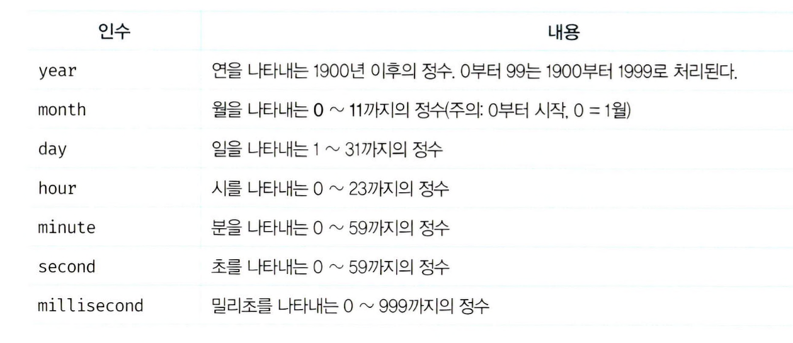

## 30.1 Date 생성자 함수
- Date 생성자 함수로 생성한 Date 객체는 내부적으로 날짜와 시간을 나타내는 정수값을 갖는다.
- 이 값은 1970년 1월 1일 00:00:00(UTC)을 기점으로 Date 객체가 나타내는 날짜와 시간까지의 밀리초를 나타낸다.
### 30.1.1 new Date()
- new 연산자와 함께 호출하면 Date 객체를 반환
  ```
  new Date(); // Mon Apr 28 2025 09:56:19 GMT+0900 (한국 표준시)
  ```
- new 연산자 없이 호출하면 문자열을 반환
  ```
  Date(); // 'Mon Apr 28 2025 09:58:50 GMT+0900 (한국 표준시)'
  ```

### 30.1.2 new Date(milliseconds)
- 숫자 타입의 밀리초를 인수로 전달하면 UTC를 기점으로 인수로 전달된 밀리초만큼 경과한 날짜와 시간을 나타내는 Date 객체를 반환한다.
  ```
  // 한국 표준시(KST) = 협정 세계시(UTC) + 9시간
  new Date(0); // Thu Jan 01 1970 09:00:00 GMT+0900 (한국 표준시)
  
  // 86400000는 1day를 의미
  // 24h * 60m * 60s * 1000ms
  new Date(86400000); // Fri Jan 02 1970 09:00:00 GMT+0900 (한국 표준시)
  ```

### 30.1.3 new Date(dateString)
- 인수로 문자열을 전달하면 지정된 날짜와 시간을 나타내는 Date 객체를 반환한다.
- 인수로 전달한 문자열은 Date.parse 메서드에 의해 해석 가능한 형식이어야 한다.
  ```
  new Date('Apr 28, 2025 10:00:00'); // Mon Apr 28 2025 10:00:00 GMT+0900 (한국 표준시)
  new Date('2025/04/28/10:00:00'); // Mon Apr 28 2025 10:00:00 GMT+0900 (한국 표준시)
  ```

### 30.1.4 new Date(year, month[, day, hour, minute, second, millisecond])
- 연, 월, 일, 시, 분, 초, 밀리초를 의미하는 숫자를 인수로 전달하면 지정된 날짜와 시간을 나타내는 Date 객체를 반환한다.
- 연, 월은 반드시 지정해야 한다. 연, 월을 지정하지 않은 경우 1970년 1월 1일 00:00:00(UTC)을 나타내는 Date 객체를 반환한다.

  ```
  // month 인수에 3을 넣어줘야 4월이 된다
  new Date(2025, 3); // Tue Apr 01 2025 00:00:00 GMT+0900 (한국 표준시)
  new Date(2025, 3, 28, 10, 0, 0, 0); // Mon Apr 28 2025 10:00:00 GMT+0900 (한국 표준시)
  
  // 이렇게 표현하는 것이 가독성이 좋다
  new Date('2025/4/28/10:00:00:00'); // Mon Apr 28 2025 10:00:00 GMT+0900 (한국 표준시)
  ```

## 30.2 Date 메서드
### 30.2.1 Date.now
- UTC를 기점으로 현재 시간까지 경과한 밀리초를 숫자로 반환
  ```
  Date.now(); // 1745803782384
  ```
  
### 30.2.2 Date.parse
- UTC를 기점으로 인수로 전달된 지정 시간까지의 밀리초를 숫자로 반환한다.
  ```
  // UTC
  Date.parse('Jan 2, 1970 00:00:00 UTC'); // 86400000
  
  // KST
  Date.parse('Jan 2, 1970 09:00:00'); // 86400000
  Date.parse('1970/01/02/09:00:00'); // 86400000
  ```

### 30.2.3 Date.UTC
- UTC를 기점으로 인수로 전달된 지정 시간까지의 밀리초를 숫자로 반환한다.
- new Date(year, month[, day, hour, minute, second, millisecond])와 같은 형식의 인수를 사용해야 한다.
  ```
  Date.UTC(1970, 0, 2); // 86400000
  Date.UTC('1970/1/2'); // NaN
  ```

### 30.2.4 Date.prototype.getFullYear
- Date 객체의 연도를 나타내는 정수를 반환한다.
  ```
  new Date('2025/04/28').getFullYear(); // 2025
  ```
  
### 30.2.5 Date.prototype.setFullYear
- Date 객체에 연도를 나타내는 정수를 설정한다.
  ```
  const today = new Date();

  today.setFullYear(2000);
  today.getFullYear(); // 2000

  today.setFullYear(1900, 0, 1);
  today.getFullYear(); // 1900

  ```

### 30.2.6 Date.prototype.getMonth
- Date 객체의 월을 나타내는 0 ~ 11의 정수를 반환한다.
- 1월은 0, 12월은 11이다.
  ```
  new Date('2025/04/28').getMonth(); // 3
  ```

### 30.2.7 Date.prototype.setMonth
- Date 객체에 월을 나타내는 0 ~ 11의 정수를 설정한다.
- 1월은 0, 12월은 11이다.
  ```
  const today = new Date();

  today.setMonth(0); // 1월
  today.getMonth(); // 0

  today.setMonth(11, 1); // 12월 1일
  today.getMonth(); // 11
  ```

### 30.2.8 Date.prototype.getDate
- Date 객체에 날짜(1 ~ 31)를 나타내는 정수를 반환한다.
  ```
  new Date('2025/04/28').getDate(); // 28
  ```

### 30.2.9 Date.prototype.setDate
- Date 객체에 날짜(1 ~ 31)를 나타내는 정수를 설정한다.
  ```
  const today = new Date();

  today.setDate(1);
  today.getDate(); // 1
  ```
 
### 30.2.10 Date.prototype.getDay
- Date 객체의 요일(0 ~ 6)을 나타내는 정수를 반환한다.
- 일요일: 0, 월요일: 1, ... , 토요일: 6
  ```
  new Date('2025/04/28').getDay(); // 1
  ```

### 30.2.11 Date.prototype.getHours
- Date 객체의 시간(0 ~ 23)을 나타내는 정수를 반환한다.
  ```
  new Date('2025/04/28 12:00').getHours(); // 12
  ```

### 30.2.12 Date.prototype.setHours
- Date 객체에 시간(0 ~ 23)을 나타내는 정수를 설정한다.
  ```
  const today = new Date();

  today.setHours(7);
  today.getHours(); // 7

  today.setHours(0, 0, 0, 0); // 00:00:00:00 시:분:초:밀리초
  today.getHours(); // 0
  ```

### 30.2.13 Date.prototype.getMinutes
- Date 객체의 분(0 ~ 59)을 나타내는 정수를 반환한다.
  ```
  new Date('2025/04/28 12:30').getMinutes(); // 30
  ```

### 30.2.14 Date.prototype.setMinutes
- Date 객체에 분(0 ~ 59)을 나타내는 정수를 설정한다.
  ```
  const today = new Date();

  today.setMinutes(50);
  today.getMinutes(); // 50

  today.setMinutes(5, 10, 999); // 분:초:밀리초
  today.getMinutes(); // 5
  ```

### 30.2.15 Date.prototype.getSeconds
- Date 객체의 초(0 ~ 59)를 나타내는 정수를 반환한다.
  ```
  new Date('2025/04/28 12:30:10').getSeconds(); // 10
  ```

### 30.2.16 Date.prototype.setSeconds
- Date 객체에 초(0 ~ 59)를 나타내는 정수를 설정한다.
  ```
  const today = new Date();

  today.setSeconds(30);
  today.getSeconds(); // 30

  today.setSeconds(10, 999); // 초:밀리초
  today.getSeconds(); // 10
  ```

### 30.2.17 Date.prototype.getMilliseconds
- Date 객체의 밀리초(0 ~ 999)를 나타내는 정수를 반환한다.
  ```
  new Date('2025/04/28 12:30:10:150').getMilliseconds(); // 150
  ```

### 30.2.18 Date.prototype.setMilliseconds
- Date 객체에 밀리초(0 ~ 999)를 나타내는 정수를 설정한다.
  ```
  const today = new Date();

  today.setMilliseconds(123); 
  today.getMilliseconds(); // 123
  ```

### 30.2.19 Date.prototype.getTime
- UTC를 기점으로 Date 객체의 시간까지 경과된 밀리초를 반환한다.
  ```
  new Date('2025/04/28 12:30').getTime(); // 1745811000000
  ```

### 30.2.20 Date.prototype.setTime
- Date 객체에 UTC를 기점으로 경과된 밀리초를 설정한다.
  ```
  const today = new Date();

  today.setTime(86400000);
  console.log(today); // Fri Jan 02 1970 09:00:00 GMT+0900 (한국 표준시)
  ```

### 30.2.21 Date.prototype.getTimezoneOffset
- UTC와 Date객체에 지정된 로캘 시간과의 차이를 분 단위로 반환한다.
- UTC = KST - 9h
  ```
  const today = new Date(); // today의 지정 로캘은 KST다.
  today.getTimezoneOffset() / 60; // -9
  ```

### 30.2.22 Date.prototype.toDateString
- 사람이 읽을 수 있는 형식의 문자열로 Date 객체의 날짜를 반환한다.
  ```
  const today = new Date('2025/4/28/12:30');
  
  today.toString(); // 'Mon Apr 28 2025 12:30:00 GMT+0900 (한국 표준시)'
  today.toDateString(); // 'Mon Apr 28 2025'
  ```

### 30.2.23 Date.prototype.toTimeString
- 사람이 읽을 수 있는 형식으로 Date 객체의 시간을 표현한 문자열을 반환한다.
  ```
  const today = new Date('2025/4/28/12:30');
  
  today.toString(); // 'Mon Apr 28 2025 12:30:00 GMT+0900 (한국 표준시)'
  today.toTimeString(); // '12:30:00 GMT+0900 (한국 표준시)'
  ```

### 30.2.24 Date.prototype.toISOString
- ISO 8601 (날짜와 시간을 표현하는 국제 표준) 형식으로 Date 객체의 날짜와 시간을 표현한 문자열을 반환한다.
  ```
  const today = new Date('2025/4/28/12:30');

  today.toString(); // 'Mon Apr 28 2025 12:30:00 GMT+0900 (한국 표준시)'
  today.toISOString(); // '2025-04-28T03:30:00.000Z'

  today.toISOString().slice(0, 10); // '2025-04-28'
  ```

### 30.2.25 Date.prototype.toLocaleString
- 인수로 전달한 로캘을 기준으로 Date 객체의 날짜와 시간을 표현한 문자열을 반환한다.
- 인수를 생략한 경우 브라우저가 동작 중인 시스템의 로캘을 적용한다.
  ```
  const today = new Date('2025/4/28/12:30');

  today.toString(); // 'Mon Apr 28 2025 12:30:00 GMT+0900 (한국 표준시)'
  today.toLocaleString(); // '2025. 4. 28. 오후 12:30:00'
  today.toLocaleString('ko-KR'); // '2025. 4. 28. 오후 12:30:00'
  today.toLocaleString('en-US'); // '4/28/2025, 12:30:00 PM'
  today.toLocaleString('ja-JP'); // '2025/4/28 12:30:00'
  ```

### 30.2.26 Date.prototype.toLocaleTimeString
- 인수로 전달한 로캘을 기준으로 Date 객체의 시간을 표현한 문자열을 반환한다.
- 인수를 생략한 경우 브라우저가 동작 중인 시스템의 로캘을 적용한다.
  ```
  const today = new Date('2025/4/28/12:30');

  today.toString(); // 'Mon Apr 28 2025 12:30:00 GMT+0900 (한국 표준시)'
  today.toLocaleTimeString(); // '오후 12:30:00'
  today.toLocaleTimeString('ko-KR'); // '오후 12:30:00'
  today.toLocaleTimeString('en-US'); // '12:30:00 PM'
  today.toLocaleTimeString('ja-JP'); // '12:30:00'
  ```
